# AI Engineering Principles

> A northstar document for building production-grade agentic applications.
> Extracted from the **TeachMeWoW Agent** — a LangGraph-powered coaching backend built with FastAPI and Clean Architecture.

---

## Table of Contents

1. [Philosophy](#1-philosophy)
2. [System Architecture Overview](#2-system-architecture-overview)
3. [Clean Architecture: The Four Layers](#3-clean-architecture-the-four-layers)
4. [The LangGraph Agent Core](#4-the-langgraph-agent-core)
5. [Streaming Architecture: SSE Orchestration](#5-streaming-architecture-sse-orchestration)
6. [The Observer Pattern for Side Effects](#6-the-observer-pattern-for-side-effects)
7. [Dependency Injection & Composition Root](#7-dependency-injection--composition-root)
8. [Data Flow: From HTTP Request to AI Response](#8-data-flow-from-http-request-to-ai-response)
9. [Message Lifecycle & Bidirectional Mapping](#9-message-lifecycle--bidirectional-mapping)
10. [Tool Design Patterns](#10-tool-design-patterns)
11. [State Management & Isolation](#11-state-management--isolation)
12. [Infrastructure Patterns](#12-infrastructure-patterns)
13. [File-Level Architecture Reference](#13-file-level-architecture-reference)
14. [Design Principles Cheat Sheet](#14-design-principles-cheat-sheet)

---

## 1. Philosophy

This codebase embodies a single idea: **an AI agent is just a node in a well-structured application**. The LLM is not the center of the universe — it is a swappable infrastructure dependency, no different from a database or an HTTP client.

### Core Tenets

| Tenet                                      | What it means in practice                                                                                                                                                                       |
| ------------------------------------------ | ----------------------------------------------------------------------------------------------------------------------------------------------------------------------------------------------- |
| **LLM as Infrastructure**                  | The `LLMClient` wrapper lives in the infrastructure layer, not in business logic. Swap OpenAI for Anthropic by changing one file.                                                               |
| **Multi-Model Separation**                 | Three purpose-built models (main, explorer, classifier) — each with its own temperature, reasoning effort, and cost profile. A single `LLMClient` facade hides the complexity.                  |
| **Graph as Singleton, State as Ephemeral** | The compiled LangGraph is built once at startup. Each request creates its own `AgentState` — zero shared mutable state between concurrent users.                                                |
| **Streaming as a First-Class Citizen**     | The SSE pipeline is not bolted on after the fact. It is the primary delivery mechanism, with debouncing, strategy-based event routing, and observer hooks baked in.                             |
| **Domain Purity**                          | Domain entities have zero external dependencies. No SQLAlchemy, no LangChain, no FastAPI imports in the `domain/` layer.                                                                        |
| **Protocol over Inheritance**              | Repository interfaces use Python's `Protocol` (structural subtyping) instead of abstract base classes. Implementations satisfy the contract implicitly — no forced `super().__init__()` chains. |

---

## 2. System Architecture Overview

### High-Level Component Diagram

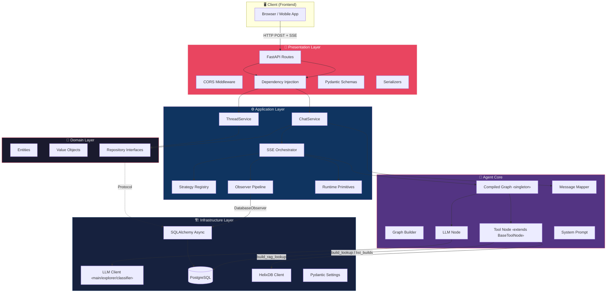
```mermaid
graph TB
    subgraph Client["🖥️ Client (Frontend)"]
        FE[Browser / Mobile App]
    end

    subgraph Presentation["📡 Presentation Layer"]
        API[FastAPI Routes]
        CORS[CORS Middleware]
        DI[Dependency Injection]
        SCH[Pydantic Schemas]
        SER[Serializers]
    end

    subgraph Application["⚙️ Application Layer"]
        CS[ChatService]
        TS[ThreadService]
        ORCH[SSE Orchestrator]
        STRAT[Strategy Registry]
        OBS[Observer Pipeline]
        RUNTIME[Runtime Primitives]
    end

    subgraph Agent["🤖 Agent Core"]
        GB[Graph Builder]
        GR[Compiled Graph ‹singleton›]
        LN[LLM Node]
        TN[Tool Node ‹extends BaseToolNode›]
        SP[System Prompt]
        MM[Message Mapper]
    end

    subgraph Infrastructure["🏗️ Infrastructure Layer"]
        LLM[LLM Client ‹main/explorer/classifier›]
        DB[(PostgreSQL)]
        SA[SQLAlchemy Async]
        HX[HelixDB Client]
        CFG[Pydantic Settings]
    end

    subgraph Domain["💎 Domain Layer"]
        ENT[Entities]
        VO[Value Objects]
        REPO[Repository Interfaces]
    end

    FE -->|HTTP POST + SSE| API
    API --> DI --> CS
    API --> DI --> TS
    CS --> ORCH --> GR
    ORCH --> STRAT
    ORCH --> OBS
    ORCH --> RUNTIME
    GR --> LN --> LLM
    GR --> TN
    TN -->|build_lookup / list_builds| DB
    TN -->|build_rag_lookup| HX
    OBS -->|DatabaseObserver| SA
    SA --> DB
    CS --> MM
    CS --> REPO
    TS --> REPO
    REPO -.->|Protocol| SA

    style Domain fill:#1a1a2e,stroke:#e94560,color:#eee
    style Infrastructure fill:#16213e,stroke:#0f3460,color:#eee
    style Application fill:#0f3460,stroke:#533483,color:#eee
    style Agent fill:#533483,stroke:#e94560,color:#eee
    style Presentation fill:#e94560,stroke:#eee,color:#fff
```

### Tech Stack

| Layer                 | Technology              | Purpose                                                             |
| --------------------- | ----------------------- | ------------------------------------------------------------------- |
| **Runtime**           | Python 3.12+            | Modern Python with `StrEnum`, union types, `match` statements       |
| **Web Framework**     | FastAPI                 | Async HTTP, SSE streaming, dependency injection                     |
| **Agent Framework**   | LangGraph 0.2+          | Stateful graph with `astream_events` v2, prebuilt `tools_condition` |
| **LLM Orchestration** | LangChain 0.3+          | Message types, tool binding, `BaseChatModel` abstraction            |
| **LLM Provider**      | OpenAI (gpt-5.2 / nano) | Via `langchain-openai`, streaming enabled, reasoning support        |
| **Database**          | PostgreSQL 16           | Relational storage with JSONB for tool calls and build payloads     |
| **ORM**               | SQLAlchemy 2.0 (async)  | `asyncpg` driver, async sessionmaker, mapped columns                |
| **Migrations**        | Alembic                 | Autogenerate with naming conventions                                |
| **Graph DB**          | HelixDB                 | Domain knowledge retrieval via `helix-py` SDK (claims, procedures)  |
| **Validation**        | Pydantic v2             | Request/response schemas, settings, agent state                     |
| **Package Manager**   | uv                      | Lockfile-based dependency resolution                                |
| **Linting**           | Ruff                    | Python 3.12 target, import sorting, bugbear rules                   |
| **Testing**           | pytest + pytest-asyncio | Auto async mode, httpx for API tests                                |

---

## 3. Clean Architecture: The Four Layers

The codebase follows a strict **Clean Architecture** (aka Hexagonal/Ports-and-Adapters) with an inside-out dependency rule: **inner layers never import from outer layers**.

### Layer Dependency Flow

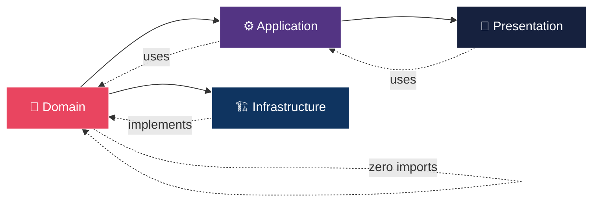
```mermaid
graph LR
    D["💎 Domain"] --> A["⚙️ Application"]
    D --> I["🏗️ Infrastructure"]
    A --> P["📡 Presentation"]

    D -.->|"zero imports"| D
    I -.->|"implements"| D
    A -.->|"uses"| D
    P -.->|"uses"| A

    style D fill:#e94560,stroke:#fff,color:#fff
    style A fill:#533483,stroke:#fff,color:#fff
    style I fill:#0f3460,stroke:#fff,color:#fff
    style P fill:#16213e,stroke:#fff,color:#fff
```

> **Golden Rule**: _Domain imports nothing. Infrastructure implements domain interfaces. Application orchestrates both. Presentation is the thinnest shell._

---

### 3.1 Domain Layer (`app/domain/`)

The innermost layer. Contains **entities**, **value objects**, and **repository interfaces**. Has zero external dependencies — no SQLAlchemy, no LangChain, no FastAPI.

#### Entities

Entities are plain Python `@dataclass` objects with identity and behavior. They represent the core business concepts.

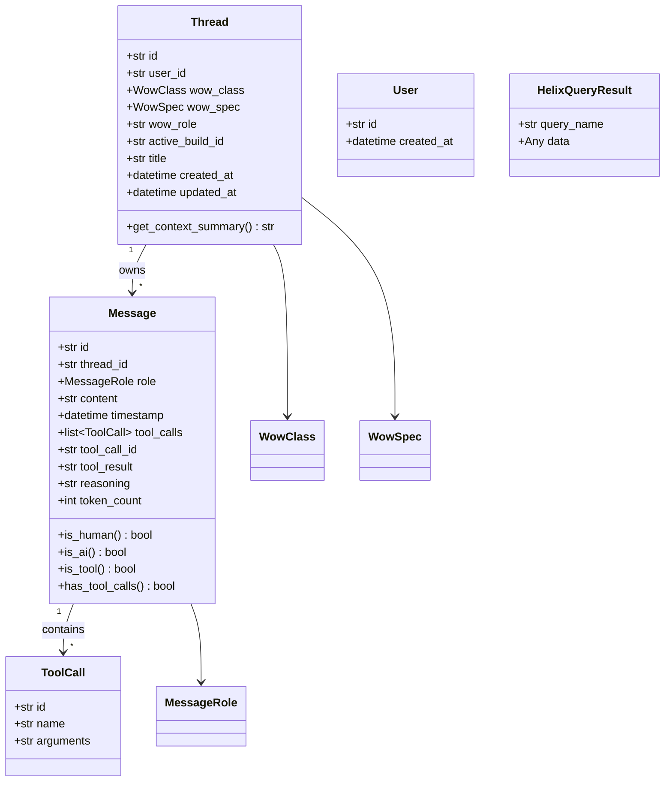
```mermaid
classDiagram
    class Message {
        +str id
        +str thread_id
        +MessageRole role
        +str content
        +datetime timestamp
        +list~ToolCall~ tool_calls
        +str tool_call_id
        +str tool_result
        +str reasoning
        +int token_count
        +is_human() bool
        +is_ai() bool
        +is_tool() bool
        +has_tool_calls() bool
    }

    class ToolCall {
        +str id
        +str name
        +str arguments
    }

    class Thread {
        +str id
        +str user_id
        +WowClass wow_class
        +WowSpec wow_spec
        +str wow_role
        +str active_build_id
        +str title
        +datetime created_at
        +datetime updated_at
        +get_context_summary() str
    }

    class User {
        +str id
        +datetime created_at
    }

    class HelixQueryResult {
        +str query_name
        +Any data
    }

    Message "1" --> "*" ToolCall : contains
    Thread "1" --> "*" Message : owns
    Thread --> WowClass
    Thread --> WowSpec
    Message --> MessageRole
```

**Why `@dataclass` instead of Pydantic?** Domain entities should be pure data containers without validation framework coupling. Pydantic is used at boundaries (API schemas, agent state) where serialization/validation is needed.

#### Value Objects

Immutable types that represent domain concepts without identity. Implemented as `StrEnum` for type safety and serialization:

```python
class MessageRole(StrEnum):
    HUMAN = "human"
    AI = "ai"
    SYSTEM = "system"
    TOOL = "tool"
```

> **Pattern**: `StrEnum` provides both enum safety and string serialization. `role == MessageRole.HUMAN` and `role == "human"` both work. This eliminates `.value` noise throughout the codebase.

#### Repository Interfaces (Ports)

Repository interfaces define the **contract** for persistence without specifying _how_ persistence happens. They use Python's `Protocol` class (structural subtyping):

```python
class MessageRepository(Protocol):
    async def save(self, message: Message) -> Message: ...
    async def save_many(self, messages: list[Message]) -> list[Message]: ...
    async def get_by_id(self, message_id: str) -> Message | None: ...
    async def get_by_thread_id(self, thread_id: str, limit: int | None = None, offset: int = 0) -> list[Message]: ...
    async def delete_by_thread_id(self, thread_id: str) -> int: ...
    async def get_up_to_timestamp(self, thread_id: str, up_to: datetime) -> list[Message]: ...

class ThreadRepository(Protocol):
    async def save(self, thread: Thread) -> Thread: ...
    async def get_by_id(self, thread_id: str) -> Thread | None: ...
    async def get_by_user_id(self, user_id: str, limit: int | None = None, offset: int = 0) -> list[Thread]: ...
    async def update(self, thread: Thread) -> Thread: ...
    async def delete(self, thread_id: str) -> bool: ...
    async def get_or_create(self, thread: Thread) -> tuple[Thread, bool]: ...
    async def set_active_build_id(self, thread_id: str, active_build_id: str | None) -> None: ...
```

> **Why Protocol?**: Unlike ABC, `Protocol` doesn't require explicit inheritance. Any class that implements the same method signatures satisfies the contract. This is _structural typing_ — Python's answer to Go interfaces.

---

### 3.2 Infrastructure Layer (`app/infrastructure/`)

Implements the ports defined in the domain layer. This is where external dependencies live.

#### Configuration: Pydantic Settings

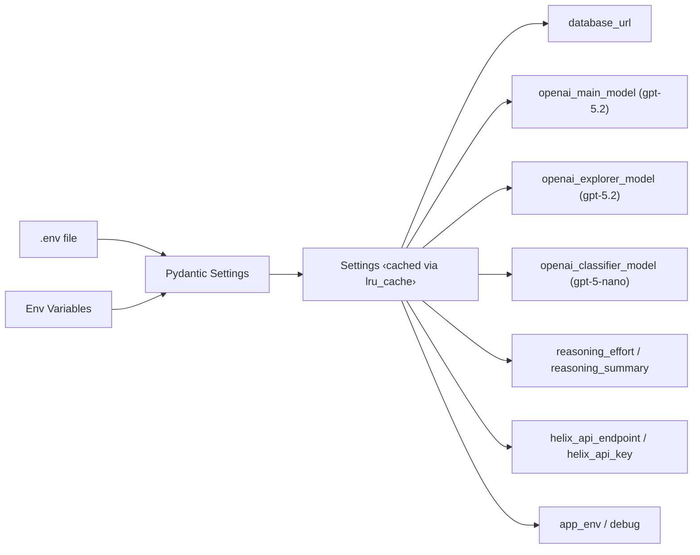
```mermaid
graph LR
    ENV[".env file"] --> PS["Pydantic Settings"]
    ENVVAR["Env Variables"] --> PS
    PS --> Settings["Settings ‹cached via lru_cache›"]
    Settings --> DB_URL["database_url"]
    Settings --> OAI_MAIN["openai_main_model (gpt-5.2)"]
    Settings --> OAI_EXPLORER["openai_explorer_model (gpt-5.2)"]
    Settings --> OAI_CLASSIFIER["openai_classifier_model (gpt-5-nano)"]
    Settings --> OAI_REASON["reasoning_effort / reasoning_summary"]
    Settings --> HLX["helix_api_endpoint / helix_api_key"]
    Settings --> APP["app_env / debug"]
```

**Pattern: Cached Settings Singleton**

```python
@lru_cache
def get_settings() -> Settings:
    return Settings()  # reads .env + env vars once
```

This avoids reading environment variables on every call. The `@lru_cache` decorator ensures a single `Settings` instance across the entire application.

#### LLM Client: Multi-Model Architecture

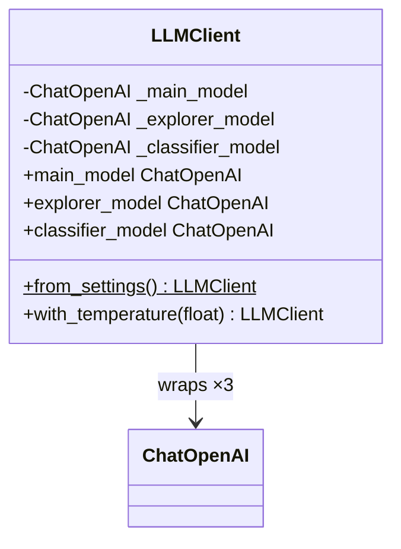
```mermaid
classDiagram
    class LLMClient {
        -ChatOpenAI _main_model
        -ChatOpenAI _explorer_model
        -ChatOpenAI _classifier_model
        +from_settings()$ LLMClient
        +main_model ChatOpenAI
        +explorer_model ChatOpenAI
        +classifier_model ChatOpenAI
        +with_temperature(float) LLMClient
    }

    LLMClient --> ChatOpenAI : wraps ×3
```

**Pattern: Tri-Model Separation with Factory** — Instead of a single LLM, the client manages three purpose-built models:

| Model              | Default    | Purpose                                    | Config                              |
| ------------------ | ---------- | ------------------------------------------ | ----------------------------------- |
| `main_model`       | gpt-5.2    | Primary agent reasoning and chat           | Temperature 0.7, streaming          |
| `explorer_model`   | gpt-5.2    | Deep knowledge exploration (RAG grounding) | Reasoning effort/summary, streaming |
| `classifier_model` | gpt-5-nano | Fast classification and routing            | Temperature 0.2, streaming          |

`_build_model()` conditionally injects OpenAI reasoning parameters (`effort`, `summary`) only when configured. `with_temperature()` returns a _new_ instance rather than mutating state.

#### Database Connection: Async SQLAlchemy

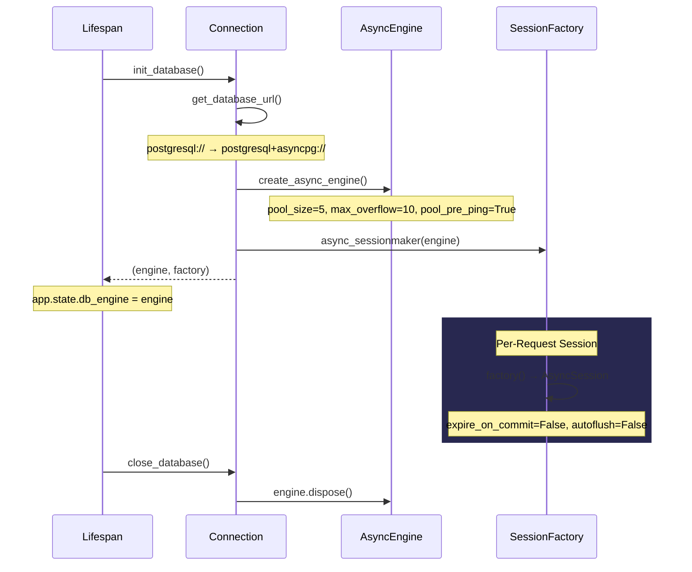
```mermaid
sequenceDiagram
    participant Lifespan
    participant Connection
    participant Engine as AsyncEngine
    participant Factory as SessionFactory

    Lifespan->>Connection: init_database()
    Connection->>Connection: get_database_url()
    Note over Connection: postgresql:// → postgresql+asyncpg://
    Connection->>Engine: create_async_engine()
    Note over Engine: pool_size=5, max_overflow=10, pool_pre_ping=True
    Connection->>Factory: async_sessionmaker(engine)
    Connection-->>Lifespan: (engine, factory)

    Note over Lifespan: app.state.db_engine = engine

    rect rgb(40, 40, 80)
        Note over Factory: Per-Request Session
        Factory->>Factory: factory() → AsyncSession
        Note over Factory: expire_on_commit=False, autoflush=False
    end

    Lifespan->>Connection: close_database()
    Connection->>Engine: engine.dispose()
```

**Key patterns**:
- The database URL is auto-converted from `postgresql://` to `postgresql+asyncpg://`, making `.env` files driver-agnostic.
- Local connections (`localhost` / `127.0.0.1`) automatically disable SSL to avoid macOS permission issues.

#### Repository Implementations (Adapters)

Each repository implementation follows the **Entity-Model Mapper** pattern:

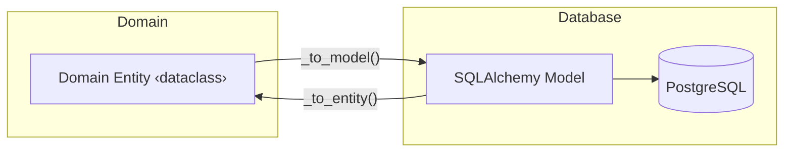
```mermaid
graph LR
    DE["Domain Entity ‹dataclass›"] -->|"_to_model()"| SM["SQLAlchemy Model"]
    SM -->|"_to_entity()"| DE

    subgraph Database
        SM --> DB[(PostgreSQL)]
    end

    subgraph Domain
        DE
    end
```

> **Pattern: Upsert with `on_conflict_do_nothing`** — The `ThreadRepositoryImpl.get_or_create()` uses PostgreSQL's `INSERT ... ON CONFLICT DO NOTHING ... RETURNING` for race-condition-free thread creation.

---

### 3.3 Application Layer (`app/application/`)

The orchestration layer. Contains the **agent graph**, **services**, **streaming infrastructure**, and the **runtime primitives** that decompose the SSE pipeline.

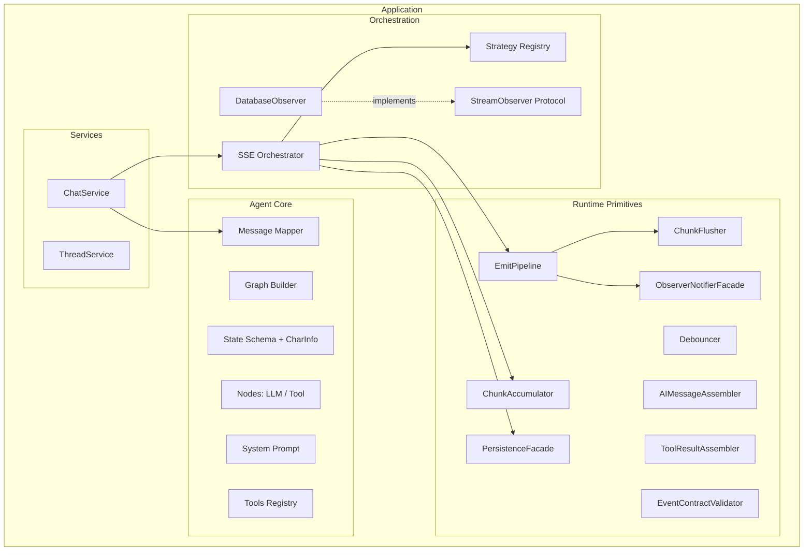
```mermaid
graph TB
    subgraph Application
        subgraph Agent Core
            GB[Graph Builder]
            SS[State Schema + CharInfo]
            ND["Nodes: LLM / Tool"]
            PR[System Prompt]
            TL[Tools Registry]
            MP[Message Mapper]
        end

        subgraph Orchestration
            ORCH[SSE Orchestrator]
            STRAT[Strategy Registry]
            OBS_BASE[StreamObserver Protocol]
            OBS_DB[DatabaseObserver]
        end

        subgraph Runtime Primitives
            ACC[ChunkAccumulator]
            FLUSH[ChunkFlusher]
            DEB[Debouncer]
            PIPE[EmitPipeline]
            PERSIST[PersistenceFacade]
            AI_ASM[AIMessageAssembler]
            TOOL_ASM[ToolResultAssembler]
            NOTIFY[ObserverNotifierFacade]
            VALID[EventContractValidator]
        end

        subgraph Services
            CS[ChatService]
            TS[ThreadService]
        end
    end

    CS --> ORCH
    CS --> MP
    ORCH --> STRAT
    ORCH --> PIPE
    ORCH --> ACC
    ORCH --> PERSIST
    PIPE --> FLUSH
    PIPE --> NOTIFY
    OBS_DB -.->|implements| OBS_BASE
```

---

### 3.4 Presentation Layer (`app/presentation/`)

The thinnest layer. Converts HTTP to service calls and domain entities to API responses.

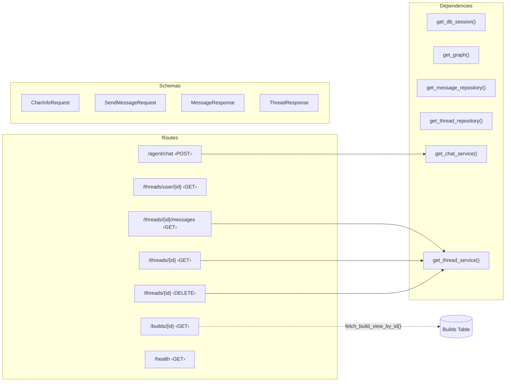
```mermaid
graph LR
    subgraph Routes
        CHAT["/agent/chat ‹POST›"]
        THR_USER["/threads/user/{id} ‹GET›"]
        THR_MSG["/threads/{id}/messages ‹GET›"]
        THR_GET["/threads/{id} ‹GET›"]
        THR_DEL["/threads/{id} ‹DELETE›"]
        BUILD_GET["/builds/{id} ‹GET›"]
        HEALTH["/health ‹GET›"]
    end

    subgraph Dependencies
        GET_SESS["get_db_session()"]
        GET_GRAPH["get_graph()"]
        GET_MSG_REPO["get_message_repository()"]
        GET_THR_REPO["get_thread_repository()"]
        GET_CS["get_chat_service()"]
        GET_TS["get_thread_service()"]
    end

    subgraph Schemas
        CIR["CharInfoRequest"]
        SMR["SendMessageRequest"]
        MR["MessageResponse"]
        TR["ThreadResponse"]
    end

    CHAT --> GET_CS
    THR_MSG --> GET_TS
    THR_GET --> GET_TS
    THR_DEL --> GET_TS
    BUILD_GET -.->|"fetch_build_view_by_id()"| DB[(Builds Table)]
```

---

## 4. The LangGraph Agent Core

### 4.1 Graph Structure: The ReAct Loop

The agent implements a **ReAct (Reason + Act)** loop as a LangGraph `StateGraph`. The routing decision uses LangGraph's prebuilt `tools_condition` — no custom router node is needed:

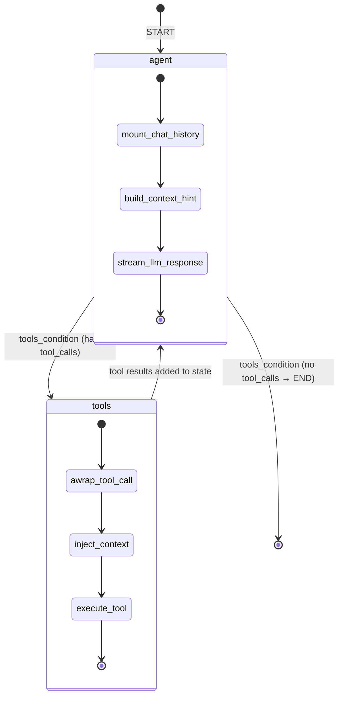
```mermaid
stateDiagram-v2
    [*] --> agent: START
    agent --> tools: tools_condition (has tool_calls)
    agent --> [*]: tools_condition (no tool_calls → END)
    tools --> agent: tool results added to state

    state agent {
        [*] --> mount_chat_history
        mount_chat_history --> build_context_hint
        build_context_hint --> stream_llm_response
        stream_llm_response --> [*]
    }

    state tools {
        [*] --> awrap_tool_call
        awrap_tool_call --> inject_context
        inject_context --> execute_tool
        execute_tool --> [*]
    }
```

### 4.2 Graph Construction: Builder Pattern

The graph is built at application startup via the **Builder Pattern** and stored as a singleton:

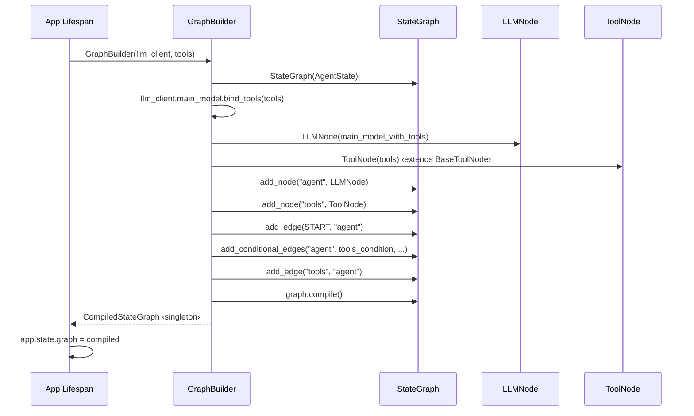
```mermaid
sequenceDiagram
    participant Lifespan as App Lifespan
    participant Builder as GraphBuilder
    participant SG as StateGraph
    participant LN as LLMNode
    participant TN as ToolNode

    Lifespan->>Builder: GraphBuilder(llm_client, tools)
    Builder->>SG: StateGraph(AgentState)
    Builder->>Builder: llm_client.main_model.bind_tools(tools)
    Builder->>LN: LLMNode(main_model_with_tools)
    Builder->>TN: ToolNode(tools) ‹extends BaseToolNode›
    Builder->>SG: add_node("agent", LLMNode)
    Builder->>SG: add_node("tools", ToolNode)
    Builder->>SG: add_edge(START, "agent")
    Builder->>SG: add_conditional_edges("agent", tools_condition, ...)
    Builder->>SG: add_edge("tools", "agent")
    Builder->>SG: graph.compile()
    Builder-->>Lifespan: CompiledStateGraph ‹singleton›
    Lifespan->>Lifespan: app.state.graph = compiled
```

> **Key change**: The graph uses LangGraph's prebuilt `tools_condition` function for routing, replacing the previous custom `RouterNode`. This aligns with LangGraph best practices and reduces custom code.

### 4.3 Node Implementations

#### LLM Node — The Thinking Step

```python
class LLMNode:
    async def __call__(self, state: AgentState, config) -> AgentState:
        chat_history = self.mount_chat_history(state)     # [SystemPrompt, ContextHint] + state.messages
        response = await self._stream_llm_response(...)   # accumulate chunks
        return {"messages": [response]}                   # reducer appends
```

**Pattern: Dual System Prompt Injection** — Two system messages are prepended on every LLM call:
1. `AGENT_SYSTEM_PROMPT` — static coaching persona
2. **Context hint** — dynamic per-request state: `class`, `spec`, `role`, `active_build_id`, `candidate_build_ids`

Neither is stored in the agent state or persisted to the database.

#### Tool Node — The Acting Step (via `awrap_tool_call`)

```python
class ToolNode(BaseToolNode):
    def __init__(self, tools: list[BaseTool]) -> None:
        super().__init__(tools, awrap_tool_call=self._awrap_tool_call)

    async def _awrap_tool_call(self, request, execute):
        updated_request = self._inject_context(request)
        return await execute(updated_request)
```

**Key evolution**: `ToolNode` now extends LangGraph's prebuilt `BaseToolNode` instead of implementing its own execution loop. The `awrap_tool_call` hook intercepts each tool call _before_ execution to inject context, while LangGraph handles tool dispatch, error wrapping, and `ToolMessage` creation.

**Context injection** reads `char_info`, `thread_id`, and `active_build_id` from the graph state and injects only fields the tool's schema declares:

```python
def _inject_context(self, request):
    args_schema = getattr(request.tool, "args_schema", None)
    fields = args_schema.model_fields if args_schema else {}
    # Only inject if the tool declares the field in its schema
    for key, value in values.items():
        if key in fields or key in injected_args:
            injected_args[key] = value
```

### 4.4 State Schema

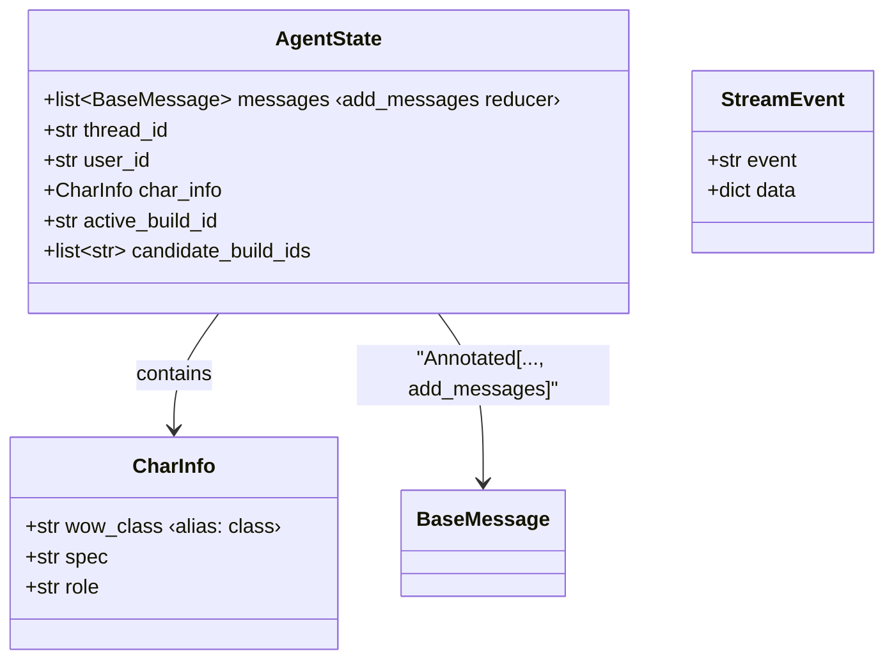
```mermaid
classDiagram
    class CharInfo {
        +str wow_class ‹alias: class›
        +str spec
        +str role
    }

    class AgentState {
        +list~BaseMessage~ messages ‹add_messages reducer›
        +str thread_id
        +str user_id
        +CharInfo char_info
        +str active_build_id
        +list~str~ candidate_build_ids
    }

    class StreamEvent {
        +str event
        +dict data
    }

    AgentState --> CharInfo : contains
    AgentState --> BaseMessage : "Annotated[..., add_messages]"
```

**Pattern: `CharInfo` Value Object** — Character context (`wow_class`, `spec`, `role`) is bundled into a strongly-typed Pydantic model with `alias="class"` to match frontend JSON. This replaces the previous flat `wow_class`/`wow_spec`/`wow_role` fields on `AgentState`.

**Pattern: Build Tracking** — `active_build_id` tracks the currently selected build (persisted per-thread), while `candidate_build_ids` holds disambiguation candidates for the current request. The `DatabaseObserver` auto-persists `active_build_id` when a `build_lookup` tool result is saved.

**Pattern: Simplified `StreamEvent`** — The event envelope was reduced to just `event` + `data` (dropped `name`, `run_id`, `parent_ids`, `metadata`, `tags`). All metadata is nested inside `data.payload` when needed.

---

## 5. Streaming Architecture: SSE Orchestration

### 5.1 Overview

The streaming pipeline is the most sophisticated part of the architecture. It has been decomposed into **runtime primitives** (single-responsibility classes) and a **strategy pattern** for event routing.

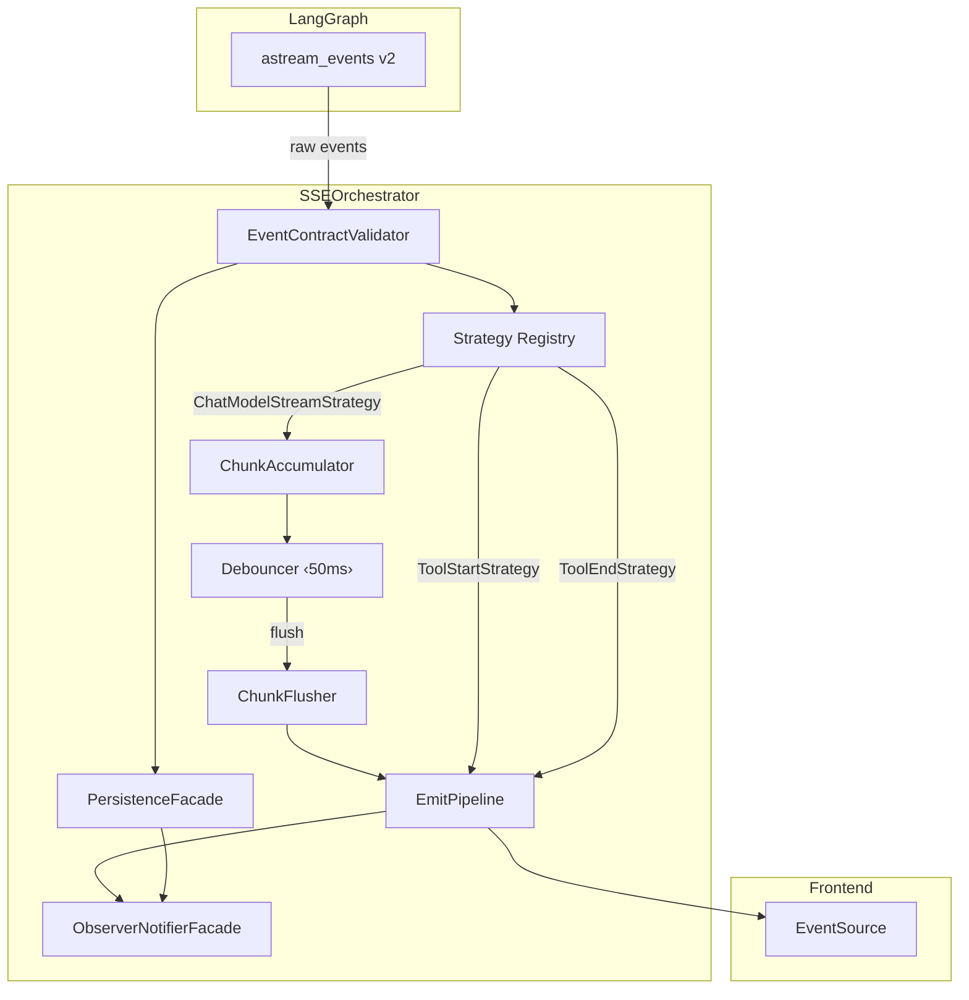
```mermaid
graph TB
    subgraph LangGraph
        EV[astream_events v2]
    end

    subgraph SSEOrchestrator
        direction TB
        VALID[EventContractValidator]
        STRAT[Strategy Registry]
        PERSIST[PersistenceFacade]
        ACC[ChunkAccumulator]
        DEB[Debouncer ‹50ms›]
        FLUSH[ChunkFlusher]
        PIPE[EmitPipeline]
        NOTIFY[ObserverNotifierFacade]
    end

    subgraph Frontend
        SSE[EventSource]
    end

    EV -->|raw events| VALID
    VALID --> STRAT
    STRAT -->|"ChatModelStreamStrategy"| ACC
    ACC --> DEB
    DEB -->|flush| FLUSH --> PIPE
    STRAT -->|"ToolStartStrategy"| PIPE
    STRAT -->|"ToolEndStrategy"| PIPE
    PIPE --> NOTIFY
    PIPE --> SSE
    VALID --> PERSIST
    PERSIST --> NOTIFY
```

### 5.2 Strategy Pattern for Event Routing

Each LangGraph event type is handled by a dedicated **strategy** class. The orchestrator looks up the strategy from a registry and delegates:

```python
strategy = self._event_strategies.get(event_kind, self._default_strategy)
emitted = await strategy.handle(event=event, ..., actions=self)
```

| Event Kind             | Strategy                     | Behavior                                    |
| ---------------------- | ---------------------------- | ------------------------------------------- |
| `on_chat_model_start`  | `ChatModelStartStrategy`     | No-op (ignored)                             |
| `on_chat_model_stream` | `ChatModelStreamStrategy`    | Accumulate + debounce                       |
| `on_chat_model_end`    | `ChatModelEndStrategy`       | Finalize AI message                         |
| `on_tool_start`        | `ToolStartStrategy`          | Flush buffer + emit immediately             |
| `on_tool_end`          | `ToolEndStrategy`            | Emit tool result immediately                |
| `on_chain_start`       | `ChainStartStrategy`         | No-op                                       |
| `on_chain_end`         | `ChainEndStrategy`           | Process node completion                     |
| `on_chain_stream`      | `IgnoreEventStrategy`        | Ignored (duplicate of model stream)         |
| `custom`               | `IgnoreEventStrategy`        | Ignored (tool events come from `on_tool_*`) |
| _(unknown)_            | `DefaultPassThroughStrategy` | Emit as generic event                       |

**Why Strategy over `if/elif` chains?** Each strategy is independently testable, and new event types can be added by registering a new class — no modification of the orchestrator's main loop.

### 5.3 Runtime Primitives (SRP Decomposition)

The monolithic `_StreamState` has been decomposed into focused, single-responsibility classes:

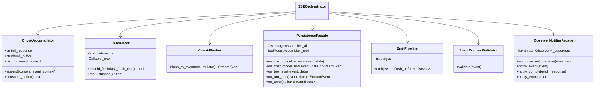
```mermaid
classDiagram
    class ChunkAccumulator {
        +str full_response
        +str chunk_buffer
        +dict llm_event_context
        +append(content, event_context)
        +consume_buffer() str
    }

    class Debouncer {
        -float _interval_s
        -Callable _now
        +should_flush(last_flush_time) bool
        +mark_flushed() float
    }

    class ChunkFlusher {
        +flush_to_event(accumulator) StreamEvent
    }

    class PersistenceFacade {
        -AIMessageAssembler _ai
        -ToolResultAssembler _tool
        +on_chat_model_stream(event, data)
        +on_chat_model_end(event, data) StreamEvent
        +on_tool_start(event, data)
        +on_tool_end(event, data) StreamEvent
        +on_error() list~StreamEvent~
    }

    class EmitPipeline {
        -list stages
        +emit(event, flush_before) list~str~
    }

    class EventContractValidator {
        +validate(event)
    }

    class ObserverNotifierFacade {
        -list~StreamObserver~ _observers
        +add(observer) / remove(observer)
        +notify_event(event)
        +notify_complete(full_response)
        +notify_error(error)
    }

    SSEOrchestrator --> ChunkAccumulator
    SSEOrchestrator --> Debouncer
    SSEOrchestrator --> ChunkFlusher
    SSEOrchestrator --> PersistenceFacade
    SSEOrchestrator --> EmitPipeline
    SSEOrchestrator --> EventContractValidator
    SSEOrchestrator --> ObserverNotifierFacade
```

### 5.4 The EmitPipeline: Chain of Responsibility

Every SSE emission passes through a four-stage pipeline:

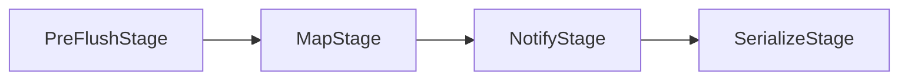
```mermaid
graph LR
    PRE[PreFlushStage] --> MAP[MapStage] --> NOTIFY_S[NotifyStage] --> SER[SerializeStage]
```

1. **`PreFlushStage`** — Flushes accumulated chunks if `flush_before=True` (e.g., before tool events)
2. **`MapStage`** — Transforms the `StreamEvent` (currently identity, extensible for future transforms)
3. **`NotifyStage`** — Notifies all observers via `ObserverNotifierFacade`
4. **`SerializeStage`** — Converts `StreamEvent` → SSE string via `format_sse_event()`

### 5.5 Persistence Side Effects (Dual Track)

The orchestrator runs two parallel tracks for each event:

1. **Streaming track** — Strategy → EmitPipeline → SSE output (what the frontend sees)
2. **Persistence track** — `PersistenceFacade` → internal `StreamEvent` → `DatabaseObserver` (what gets saved)

```python
# Persistence track runs before strategy for validated events
if event_kind in {"on_chat_model_stream", "on_chat_model_end", "on_tool_start", "on_tool_end"}:
    self._validator.validate(event)
    await self._handle_persistence_side_effects(event_kind, event, event_data, runtime_state)

# Streaming track runs for all events
strategy = self._event_strategies.get(event_kind, self._default_strategy)
emitted = await strategy.handle(...)
```

The `PersistenceFacade` emits internal events like `persist_ai_message` and `persist_tool_message` that the `DatabaseObserver` handles — keeping the streaming path completely decoupled from persistence logic.

### 5.6 Debouncing Strategy

LLM tokens arrive one-by-one, creating excessive network traffic. The orchestrator buffers tokens and flushes every 50ms:

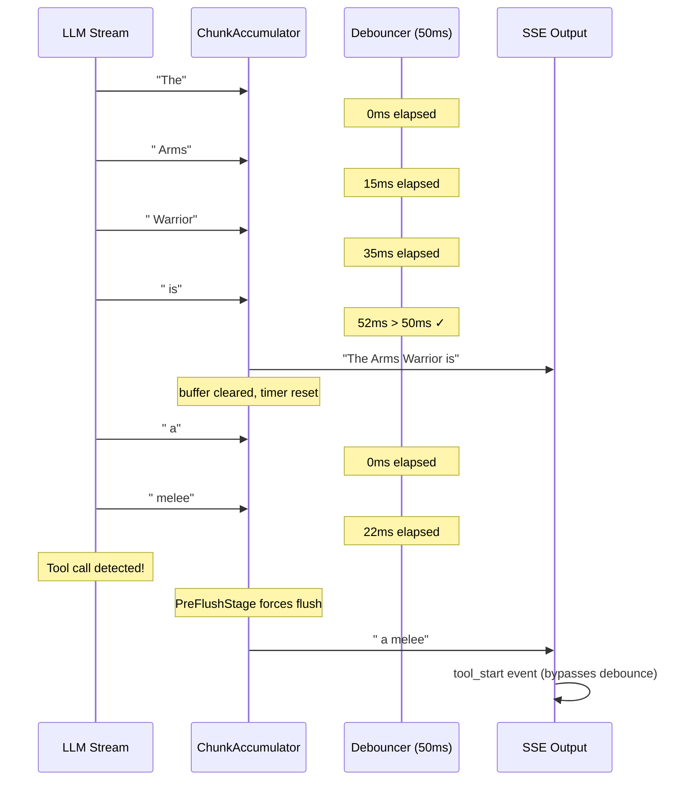
```mermaid
sequenceDiagram
    participant LLM as LLM Stream
    participant Buffer as ChunkAccumulator
    participant Timer as Debouncer (50ms)
    participant SSE as SSE Output

    LLM->>Buffer: "The"
    Note over Timer: 0ms elapsed
    LLM->>Buffer: " Arms"
    Note over Timer: 15ms elapsed
    LLM->>Buffer: " Warrior"
    Note over Timer: 35ms elapsed
    LLM->>Buffer: " is"
    Note over Timer: 52ms > 50ms ✓
    Buffer->>SSE: "The Arms Warrior is"
    Note over Buffer: buffer cleared, timer reset

    LLM->>Buffer: " a"
    Note over Timer: 0ms elapsed
    LLM->>Buffer: " melee"
    Note over Timer: 22ms elapsed

    Note over LLM: Tool call detected!
    Note over Buffer: PreFlushStage forces flush
    Buffer->>SSE: " a melee"
    SSE->>SSE: tool_start event (bypasses debounce)
```

**Key behavior**: Tool events trigger `flush_before=True` in the `EmitPipeline`, which forces the `PreFlushStage` to drain the accumulator. This ensures tool calls appear in the frontend promptly.

---

## 6. The Observer Pattern for Side Effects

### 6.1 Why Observers?

The orchestrator's job is **streaming**. Database persistence is a **side effect**. The Observer pattern decouples event processing from side effects:

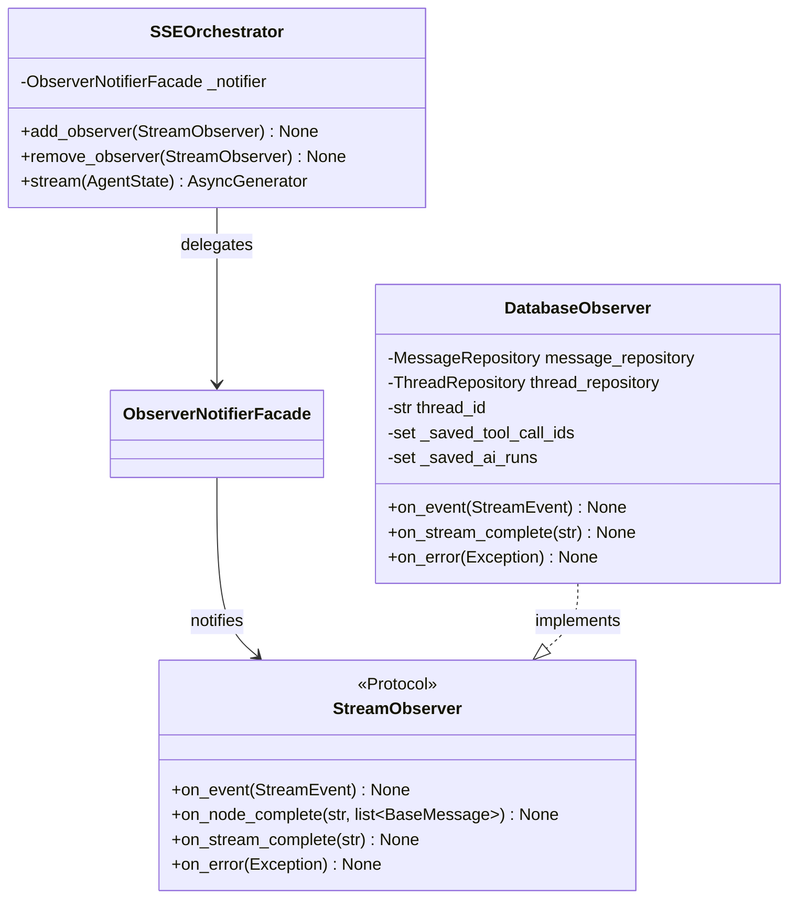
```mermaid
classDiagram
    class StreamObserver {
        <<Protocol>>
        +on_event(StreamEvent) None
        +on_node_complete(str, list~BaseMessage~) None
        +on_stream_complete(str) None
        +on_error(Exception) None
    }

    class DatabaseObserver {
        -MessageRepository message_repository
        -ThreadRepository thread_repository
        -str thread_id
        -set _saved_tool_call_ids
        -set _saved_ai_runs
        +on_event(StreamEvent) None
        +on_stream_complete(str) None
        +on_error(Exception) None
    }

    class SSEOrchestrator {
        -ObserverNotifierFacade _notifier
        +add_observer(StreamObserver) None
        +remove_observer(StreamObserver) None
        +stream(AgentState) AsyncGenerator
    }

    SSEOrchestrator --> ObserverNotifierFacade : delegates
    ObserverNotifierFacade --> StreamObserver : notifies
    DatabaseObserver ..|> StreamObserver : implements
```

### 6.2 DatabaseObserver: Event-Driven Persistence

The observer now handles normalized internal events from `PersistenceFacade`:

```python
async def on_event(self, event) -> None:
    if event.event == "persist_ai_message":
        await self._handle_ai_persistence_event(event.data)
    if event.event == "persist_tool_message":
        await self._handle_tool_persistence_event(event.data)
```

**Deduplication**: The observer tracks `_saved_ai_runs` and `_saved_tool_call_ids` sets to prevent duplicate writes — critical when LangGraph emits redundant events.

**Auto Build Tracking**: When a `build_lookup` tool result is persisted, the observer automatically calls `thread_repository.set_active_build_id()`, updating the thread's active build context for future requests.

### 6.3 Observer Lifecycle

```python
try:
    async for event in self._orchestrator.stream(state):
        yield event
finally:
    self._orchestrator.remove_observer(db_observer)
```

**Critical design decision**: The observer is added in `ChatService.process_message()` and removed in the `finally` block, ensuring clean teardown even on errors.

---

## 7. Dependency Injection & Composition Root

### 7.1 The Dependency Chain

FastAPI's `Depends()` system creates a clean dependency injection chain:

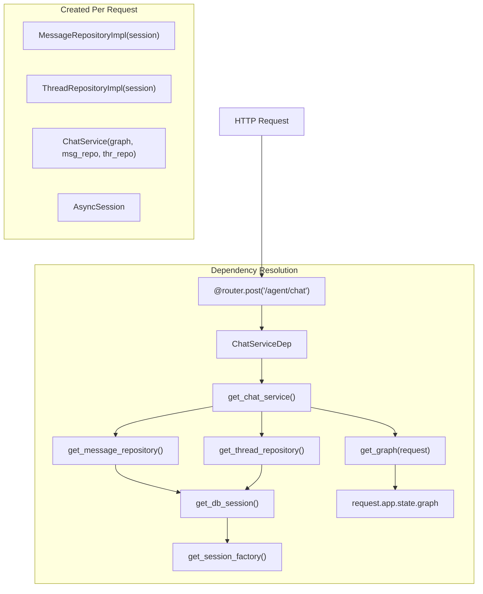
```mermaid
graph TD
    REQ[HTTP Request] --> ROUTE["@router.post('/agent/chat')"]

    subgraph Dependency Resolution
        ROUTE --> CHAT_DEP["ChatServiceDep"]
        CHAT_DEP --> GET_CS["get_chat_service()"]
        GET_CS --> GET_GRAPH["get_graph(request)"]
        GET_CS --> GET_MSG_REPO["get_message_repository()"]
        GET_CS --> GET_THR_REPO["get_thread_repository()"]

        GET_MSG_REPO --> GET_SESS["get_db_session()"]
        GET_THR_REPO --> GET_SESS

        GET_GRAPH --> APP_STATE["request.app.state.graph"]
        GET_SESS --> FACTORY["get_session_factory()"]
    end

    subgraph Created Per Request
        MSG_REPO["MessageRepositoryImpl(session)"]
        THR_REPO["ThreadRepositoryImpl(session)"]
        CHAT_SVC["ChatService(graph, msg_repo, thr_repo)"]
        SESSION["AsyncSession"]
    end
```

### 7.2 Type Aliases for Clean Routes

```python
ChatServiceDep = Annotated[ChatService, Depends(get_chat_service)]
ThreadServiceDep = Annotated[ThreadService, Depends(get_thread_service)]
```

This enables ultra-clean route signatures:

```python
@router.post("/chat")
async def send_message(
    request: SendMessageRequest,
    chat_service: ChatServiceDep,
) -> StreamingResponse:
```

### 7.3 Application Factory Pattern

The `create_app()` factory in `main.py` configures the entire application:

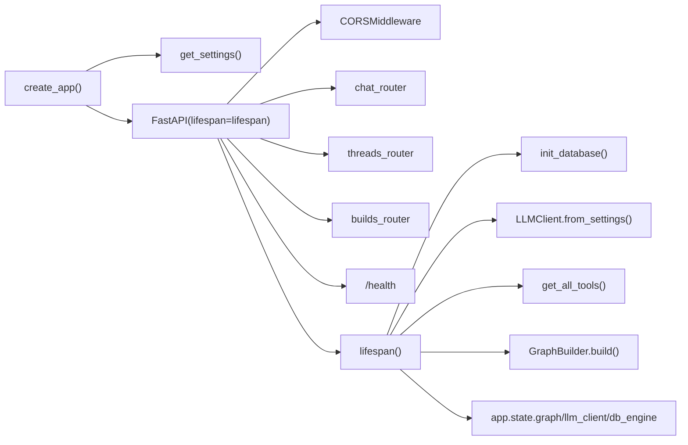
```mermaid
graph LR
    FACTORY["create_app()"] --> SETTINGS["get_settings()"]
    FACTORY --> APP["FastAPI(lifespan=lifespan)"]
    APP --> CORS["CORSMiddleware"]
    APP --> CHAT_R["chat_router"]
    APP --> THR_R["threads_router"]
    APP --> BUILD_R["builds_router"]
    APP --> HEALTH["/health"]

    APP --> LS["lifespan()"]
    LS --> DB_INIT["init_database()"]
    LS --> LLM_INIT["LLMClient.from_settings()"]
    LS --> TOOLS["get_all_tools()"]
    LS --> GB["GraphBuilder.build()"]
    LS --> STATE["app.state.graph/llm_client/db_engine"]
```

---

## 8. Data Flow: From HTTP Request to AI Response

### Complete Request Flow

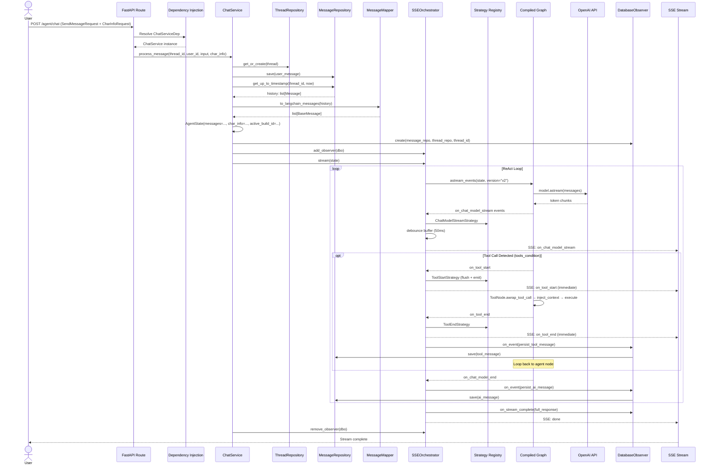
```mermaid
sequenceDiagram
    actor User
    participant API as FastAPI Route
    participant DI as Dependency Injection
    participant CS as ChatService
    participant TR as ThreadRepository
    participant MR as MessageRepository
    participant MM as MessageMapper
    participant ORCH as SSEOrchestrator
    participant STRAT as Strategy Registry
    participant GR as Compiled Graph
    participant LLM as OpenAI API
    participant DBO as DatabaseObserver
    participant SSE as SSE Stream

    User->>API: POST /agent/chat (SendMessageRequest + CharInfoRequest)
    API->>DI: Resolve ChatServiceDep
    DI-->>API: ChatService instance
    API->>CS: process_message(thread_id, user_id, input, char_info)

    CS->>TR: get_or_create(thread)
    CS->>MR: save(user_message)
    CS->>MR: get_up_to_timestamp(thread_id, now)
    MR-->>CS: history: list[Message]

    CS->>MM: to_langchain_messages(history)
    MM-->>CS: list[BaseMessage]

    CS->>CS: AgentState(messages=..., char_info=..., active_build_id=...)
    CS->>DBO: create(message_repo, thread_repo, thread_id)
    CS->>ORCH: add_observer(dbo)

    CS->>ORCH: stream(state)

    loop ReAct Loop
        ORCH->>GR: astream_events(state, version="v2")
        GR->>LLM: model.astream(messages)
        LLM-->>GR: token chunks

        GR-->>ORCH: on_chat_model_stream events
        ORCH->>STRAT: ChatModelStreamStrategy
        ORCH->>ORCH: debounce buffer (50ms)
        ORCH-->>SSE: SSE: on_chat_model_stream

        opt Tool Call Detected (tools_condition)
            GR-->>ORCH: on_tool_start
            ORCH->>STRAT: ToolStartStrategy (flush + emit)
            ORCH-->>SSE: SSE: on_tool_start (immediate)

            GR->>GR: ToolNode.awrap_tool_call → inject_context → execute
            GR-->>ORCH: on_tool_end
            ORCH->>STRAT: ToolEndStrategy
            ORCH-->>SSE: SSE: on_tool_end (immediate)
            ORCH->>DBO: on_event(persist_tool_message)
            DBO->>MR: save(tool_message)

            Note over GR: Loop back to agent node
        end

        GR-->>ORCH: on_chat_model_end
        ORCH->>DBO: on_event(persist_ai_message)
        DBO->>MR: save(ai_message)
    end

    ORCH->>DBO: on_stream_complete(full_response)
    ORCH-->>SSE: SSE: done
    CS->>ORCH: remove_observer(dbo)
    SSE-->>User: Stream complete
```

---

## 9. Message Lifecycle & Bidirectional Mapping

Messages undergo multiple transformations as they flow through the system:

### The Three Message Representations

```mermaid
graph LR
    subgraph API Boundary
        PR["Pydantic Schema<br>SendMessageRequest<br>MessageResponse"]
    end

    subgraph Domain Core
        DE["Domain Entity<br>Message ‹dataclass›"]
    end

    subgraph LangChain Runtime
        LC["LangChain Message<br>HumanMessage / AIMessage<br>ToolMessage / SystemMessage"]
    end

    subgraph Database
        SM["SQLAlchemy Model<br>MessageModel"]
    end

    PR -->|"route handler"| DE
    DE -->|"MessageMapper.to_langchain_messages()"| LC
    LC -->|"DatabaseObserver._handle_*_event()"| DE
    DE -->|"_to_model()"| SM
    SM -->|"_to_entity()"| DE
    DE -->|"serialize_message()"| PR
```

### The MessageMapper: Domain → LangChain

The `MessageMapper` uses Python's `match` statement for clean pattern matching and includes **tool call chain validation**:

```python
@staticmethod
def to_langchain_messages(messages: list[Message]) -> list[BaseMessage]:
    result: list[BaseMessage] = []
    pending_tool_calls: set[str] = set()

    for msg in messages:
        langchain_msg = MessageMapper._convert_single(msg)
        if isinstance(langchain_msg, AIMessage):
            pending_tool_calls = {tc["id"] for tc in (langchain_msg.tool_calls or [])}
        elif isinstance(langchain_msg, ToolMessage):
            if tool_call_id not in pending_tool_calls:
                continue  # skip corrupted legacy tool messages
            pending_tool_calls.remove(tool_call_id)
        ...
```

> **Pattern: Tool Chain Integrity** — `ToolMessage` records are only included if they match a `tool_call_id` from an immediately preceding `AIMessage`. Orphaned or corrupted tool messages from legacy history are silently dropped, preventing LangChain validation errors.

---

## 10. Tool Design Patterns

### 10.1 Tool Registration

Tools are registered in a central `get_all_tools()` function. Currently active:

```python
def get_all_tools() -> list[BaseTool]:
    return [list_builds, build_lookup]
```

Reserved (commented out): `build_rag_lookup`, `build_reasoning_context`.

### 10.2 The Tool Suite

| Tool                      | Purpose                                     | Data Source          | Status   |
| ------------------------- | ------------------------------------------- | -------------------- | -------- |
| `list_builds`             | List available builds for a class/spec/role | PostgreSQL           | Active   |
| `build_lookup`            | Resolve full build payload by build_id      | PostgreSQL + HelixDB | Active   |
| `build_rag_lookup`        | Build lookup + guide evidence retrieval     | PostgreSQL + HelixDB | Reserved |
| `build_reasoning_context` | Compact reasoning evidence for active build | PostgreSQL + HelixDB | Reserved |

### 10.3 Context Injection via `awrap_tool_call`

The **most important pattern** in the tool system: tools should not ask the LLM for information the system already has. The `ToolNode._inject_context()` method is invoked via LangGraph's `awrap_tool_call` hook and injects session context automatically:

```mermaid
graph LR
    LLM["LLM decides:<br>build_lookup(build_id='abc123')"]
    -->
    TN["ToolNode._inject_context()<br>via awrap_tool_call hook"]
    -->
    TOOL["build_lookup(<br>build_id='abc123',<br>char_info={class: 'warrior', ...},<br>thread_id='...',<br>active_build_id='...')"]

    style TN fill:#e94560,stroke:#fff,color:#fff
```

**Schema-aware injection**: Context is only injected for fields the tool's `args_schema` declares. If a tool doesn't declare `char_info`, it won't receive it — preventing unwanted arguments.

```python
fields = args_schema.model_fields if args_schema else {}
for key, value in values.items():
    if key in fields or key in injected_args:
        injected_args[key] = value
```

### 10.4 Build Payload Assembly

The `build_lookup` tool assembles frontend-compatible talent tree payloads by:
1. Querying `BuildModel` from PostgreSQL (import code, selections, tree IDs)
2. Querying HelixDB for talent tree node definitions (`FetchTalentTreeNodes`)
3. Computing grid positions, edges, and selection overlays
4. Returning a structured JSON payload the frontend can render directly

### 10.5 Error Containment

Tool errors are contained by LangGraph's `BaseToolNode` and returned as `ToolMessage` content. The LLM can **reason about failures** and potentially retry or inform the user, rather than crashing the request.

---

## 11. State Management & Isolation

### 11.1 Three Levels of State

```mermaid
graph TB
    subgraph Application Lifetime
        GRAPH["Compiled Graph ‹singleton›"]
        LLM_CLIENT["LLM Client ‹singleton› (3 models)"]
        SETTINGS["Settings ‹cached›"]
        HELIX["HelixDB Client ‹cached›"]
    end

    subgraph Request Lifetime
        STATE["AgentState ‹per execution›"]
        SESSION["AsyncSession ‹per request›"]
        REPOS["Repositories ‹per request›"]
        OBSERVER["DatabaseObserver ‹per request›"]
        RUNTIME["_RuntimeState ‹per stream›"]
    end

    subgraph Within Graph Execution
        MESSAGES["messages ‹add_messages reducer›"]
        CHAR["char_info ‹CharInfo VO›"]
        CONTEXT["active_build_id / candidate_build_ids"]
    end
```

### 11.2 Isolation Guarantees

| Concern              | Isolation Mechanism                                                             |
| -------------------- | ------------------------------------------------------------------------------- |
| **Concurrent users** | Each request gets its own `AgentState`, `AsyncSession`, and `DatabaseObserver`  |
| **Graph safety**     | Compiled graph is stateless — it reads state, computes, returns state delta     |
| **Database safety**  | Each session has its own transaction with commit/rollback semantics             |
| **Streaming safety** | `_RuntimeState` is created per `stream()` call — no cross-request contamination |
| **Observer cleanup** | `finally` block ensures observer removal even on exceptions                     |
| **Build tracking**   | `active_build_id` persisted per-thread, loaded from DB on each request          |

---

## 12. Infrastructure Patterns

### 12.1 Application Lifespan (Startup/Shutdown)

```python
@asynccontextmanager
async def lifespan(app: FastAPI):
    # Startup: initialize singletons
    engine, session_factory = await init_database()
    llm_client = LLMClient.from_settings()
    tools = get_all_tools()
    graph = GraphBuilder(llm_client=llm_client, tools=tools).build()
    app.state.graph = graph
    app.state.llm_client = llm_client
    app.state.db_engine = engine

    yield  # application runs

    # Shutdown: clean up resources
    await close_database()
```

### 12.2 Database Naming Conventions

```python
convention = {
    "ix": "ix_%(column_0_label)s",
    "uq": "uq_%(table_name)s_%(column_0_name)s",
    "ck": "ck_%(table_name)s_%(constraint_name)s",
    "fk": "fk_%(table_name)s_%(column_0_name)s_%(referred_table_name)s",
    "pk": "pk_%(table_name)s",
}
```

All database constraints have predictable, deterministic names — critical for Alembic migrations.

### 12.3 Session Management: Dual Pattern

**Context Manager** (for tools and standalone queries):

```python
@asynccontextmanager
async def get_session() -> AsyncGenerator[AsyncSession, None]:
    factory = get_session_factory()
    async with factory() as session:
        try:
            yield session
            await session.commit()
        except Exception:
            await session.rollback()
            raise
```

**FastAPI Dependency** (for request-scoped sessions, with inactive-session recovery):

```python
async def get_db_session() -> AsyncSession:
    factory = get_session_factory()
    async with factory() as session:
        try:
            yield session
            if not session.sync_session.is_active:
                await session.rollback()  # recover from SSE-swallowed errors
                return
            await session.commit()
        except Exception:
            await session.rollback()
            raise
```

### 12.4 SSE Response Headers

```python
StreamingResponse(
    ...,
    media_type="text/event-stream",
    headers={
        "Cache-Control": "no-cache",
        "Connection": "keep-alive",
        "X-Accel-Buffering": "no",  # Nginx: disable proxy buffering
    },
)
```

`X-Accel-Buffering: no` is critical for NGINX reverse proxies — without it, NGINX will buffer the entire SSE stream.

---

## 13. File-Level Architecture Reference

### Complete File Tree with Purpose

```
app/
├── __init__.py                           # Package version
├── main.py                               # Application factory (create_app)
├── lifespan.py                           # Startup/shutdown lifecycle
│
├── domain/                               # 💎 PURE DOMAIN — ZERO EXTERNAL DEPS
│   ├── __init__.py                       # Public API: entities, VOs, repos
│   ├── entities/
│   │   ├── __init__.py                   # Exports: Message, ToolCall, Thread, User
│   │   ├── message.py                    # Message entity + ToolCall dataclass
│   │   ├── thread.py                     # Thread entity (with active_build_id)
│   │   ├── user.py                       # User entity (minimal)
│   │   └── helix_query_result.py         # Pydantic model for Helix responses
│   ├── value_objects/
│   │   ├── __init__.py                   # Exports: MessageRole, WowClass, WowSpec
│   │   ├── message_role.py              # StrEnum: human/ai/system/tool
│   │   ├── wow_class.py                 # StrEnum: 13 WoW classes
│   │   └── wow_spec.py                  # StrEnum: 36 WoW specializations
│   └── repositories/
│       ├── __init__.py                   # Exports: MessageRepository, ThreadRepository
│       ├── message_repository.py         # Protocol: async CRUD for messages
│       └── thread_repository.py          # Protocol: async CRUD + get_or_create + set_active_build_id
│
├── infrastructure/                       # 🏗️ EXTERNAL DEPENDENCIES
│   ├── __init__.py                       # Public API: all infrastructure exports
│   ├── config/
│   │   ├── __init__.py
│   │   └── settings.py                   # Pydantic Settings + lru_cache singleton
│   ├── database/
│   │   ├── __init__.py                   # Exports: Base, init/close, repos
│   │   ├── connection.py                 # Engine, session factory, lifecycle, get_session()
│   │   ├── models/
│   │   │   ├── __init__.py
│   │   │   ├── message_model.py          # MessageModel (JSONB for tool_calls)
│   │   │   ├── thread_model.py           # ThreadModel (auto-timestamps, active_build_id)
│   │   │   └── build_model.py            # BuildModel (JSONB for tree/selections payloads)
│   │   └── repositories/
│   │       ├── __init__.py
│   │       ├── message_repository_impl.py # Full async CRUD + entity-model mapping
│   │       └── thread_repository_impl.py  # Including PG upsert + set_active_build_id
│   ├── llm/
│   │   ├── __init__.py
│   │   └── client.py                     # LLMClient: tri-model factory (main/explorer/classifier)
│   └── helix/
│       ├── __init__.py
│       └── client.py                     # HelixQueryClient (lru_cache singleton)
│
├── application/                          # ⚙️ BUSINESS LOGIC & ORCHESTRATION
│   ├── __init__.py                       # Public API: services, agent
│   ├── agent/
│   │   ├── __init__.py                   # Agent public API exports
│   │   ├── graph_builder.py              # GraphBuilder: factory → CompiledStateGraph
│   │   ├── state_schema.py               # AgentState + CharInfo + StreamEvent
│   │   ├── streaming.py                  # format_sse_event + build_langchain_stream_event
│   │   ├── prompts/
│   │   │   └── system_prompt.py          # AGENT_SYSTEM_PROMPT constant
│   │   ├── nodes/
│   │   │   ├── __init__.py
│   │   │   ├── llm_node.py              # LLMNode: system prompt + context hint + streaming
│   │   │   └── tool_node.py             # ToolNode: extends BaseToolNode + awrap_tool_call
│   │   ├── mappers/
│   │   │   ├── __init__.py
│   │   │   └── message_mapper.py         # MessageMapper: domain ↔ LangChain (match + tool chain validation)
│   │   ├── orchestrators/
│   │   │   ├── __init__.py
│   │   │   ├── sse_orchestrator.py       # SSEOrchestrator: strategy dispatch + runtime state
│   │   │   ├── observers/
│   │   │   │   ├── __init__.py
│   │   │   │   ├── base.py              # StreamObserver (Protocol)
│   │   │   │   └── db_observer.py        # DatabaseObserver: event-driven persistence + build tracking
│   │   │   ├── strategies/
│   │   │   │   ├── __init__.py
│   │   │   │   ├── base.py              # StreamEventStrategy + StreamOrchestratorActions (Protocols)
│   │   │   │   └── defaults.py           # 9 strategy implementations + registry factory
│   │   │   └── runtime/
│   │   │       ├── __init__.py
│   │   │       ├── ai_message_assembler.py   # Accumulates AI stream deltas → AssembledAIMessage
│   │   │       ├── chunk_accumulator.py       # Buffer for streamed LLM content
│   │   │       ├── chunk_flusher.py           # Converts accumulated chunks → StreamEvent
│   │   │       ├── debouncer.py               # Time-based flush cadence (50ms)
│   │   │       ├── emit_pipeline.py           # 4-stage chain of responsibility for SSE emission
│   │   │       ├── event_contract_validator.py # Runtime contract validation for LangGraph events
│   │   │       ├── observer_notifier.py       # Facade for broadcasting to observers
│   │   │       ├── persistence_facade.py      # Event-driven message assembly for DB persistence
│   │   │       └── tool_result_assembler.py   # Pairs tool start/end events → AssembledToolResult
│   │   └── tools/
│   │       ├── __init__.py               # get_all_tools() registry
│   │       ├── build_lookup.py           # @tool: resolve build + talent tree payload
│   │       ├── build_rag_lookup.py       # @tool: build + guide evidence (reserved)
│   │       ├── build_reasoning_context.py # @tool: compact reasoning evidence (reserved)
│   │       └── list_builds.py            # @tool: list available builds for class/spec/role
│   ├── services/
│   │   ├── __init__.py
│   │   ├── chat_service.py              # ChatService: full message → SSE pipeline
│   │   └── thread_service.py            # ThreadService: thread CRUD
│   └── use_cases/
│       └── __init__.py                   # (reserved for future use cases)
│
└── presentation/                         # 📡 HTTP BOUNDARY
    ├── __init__.py                       # Public API: routers, schemas, serializers
    ├── api/
    │   ├── __init__.py
    │   ├── dependencies.py               # FastAPI Depends chain + type aliases
    │   └── routes/
    │       ├── __init__.py
    │       ├── chat.py                   # POST /agent/chat → StreamingResponse
    │       ├── threads.py               # GET/DELETE /threads/{id}[/messages], GET /threads/user/{id}
    │       └── builds.py                # GET /builds/{id} → build payload
    ├── schemas/
    │   ├── __init__.py
    │   ├── chat.py                      # CharInfoRequest, SendMessageRequest, MessageResponse
    │   └── thread.py                    # ThreadResponse, CreateThreadRequest
    └── serializers/
        ├── __init__.py
        └── message_serializer.py         # serialize_message(), serialize_thread()
```

---

## 14. Design Principles Cheat Sheet

### The Rules

| #   | Principle                                    | Implementation                                                                                  |
| --- | -------------------------------------------- | ----------------------------------------------------------------------------------------------- |
| 1   | **Domain never imports infrastructure**      | `domain/` has zero imports from `infrastructure/`, `application/`, or `presentation/`           |
| 2   | **One entity, three representations**        | Domain dataclass → SQLAlchemy model → Pydantic schema. Each boundary has its own type.          |
| 3   | **Protocol over ABC**                        | Repository interfaces use `Protocol` for structural typing                                      |
| 4   | **Graph is a singleton, state is ephemeral** | `CompiledStateGraph` built once at startup, `AgentState` created per request                    |
| 5   | **Observer for side effects**                | Database persistence decoupled from streaming via `StreamObserver` protocol                     |
| 6   | **Strategy pattern for event routing**       | Each LangGraph event type handled by pluggable strategy class                                   |
| 7   | **Runtime SRP decomposition**                | Monolithic orchestrator decomposed into 8 single-responsibility primitives                      |
| 8   | **Debounce the stream, bypass for tools**    | 50ms buffer for LLM tokens, `flush_before=True` for tool events                                 |
| 9   | **Context injection, not LLM extraction**    | `ToolNode._inject_context()` via `awrap_tool_call` — schema-aware, only injects declared fields |
| 10  | **System prompt is runtime, not state**      | System prompt + context hint prepended on each LLM call, never persisted                        |
| 11  | **Error containment in tools**               | Tool errors become `ToolMessage` content — the LLM reasons about failures                       |
| 12  | **Tool chain integrity**                     | `MessageMapper` validates `ToolMessage` ↔ `AIMessage.tool_calls` pairing, drops orphans         |
| 13  | **Multi-model separation**                   | 3 purpose-built models (main/explorer/classifier) behind single `LLMClient` facade              |
| 14  | **Factory functions for everything**         | `create_app()`, `create_chat_service()`, `LLMClient.from_settings()`, `get_all_tools()`         |
| 15  | **Type aliases for clean routes**            | `ChatServiceDep = Annotated[ChatService, Depends(get_chat_service)]`                            |
| 16  | **`lru_cache` for singletons**               | Settings, HelixDB client cached via `@lru_cache`                                                |
| 17  | **Naming conventions for DB constraints**    | Deterministic constraint names for Alembic migrations                                           |
| 18  | **Auto-commit/rollback sessions**            | Context manager + inactive-session recovery in FastAPI dependency                               |
| 19  | **SSE headers for proxy compatibility**      | `X-Accel-Buffering: no` for NGINX, `Cache-Control: no-cache` for CDNs                           |
| 20  | **Persistence dual-track**                   | Streaming and persistence run as parallel tracks with normalized internal events                |

### The Anti-Patterns This Architecture Avoids

| Anti-Pattern                      | How it's avoided                                                                          |
| --------------------------------- | ----------------------------------------------------------------------------------------- |
| **God service**                   | `ChatService` delegates to `SSEOrchestrator`, `DatabaseObserver`, and `PersistenceFacade` |
| **Leaky abstraction**             | SQLAlchemy never leaks past `_to_entity()` boundaries                                     |
| **Shared mutable state**          | No globals. Graph is immutable after compile. State is per-request.                       |
| **Framework coupling**            | Domain entities are pure Python. Swap FastAPI for Flask without touching `domain/`.       |
| **Monolithic orchestrator**       | SSE pipeline decomposed into strategies → runtime primitives → emit pipeline → observers  |
| **LLM-driven context extraction** | Context injection prevents LLMs from re-extracting known information                      |
| **Silent tool failures**          | All tool errors surfaced as `ToolMessage` content for LLM reasoning                       |
| **Corrupted message history**     | `MessageMapper` validates tool call chains, drops orphaned `ToolMessage` records          |
| **Custom routing logic**          | LangGraph prebuilt `tools_condition` replaces hand-written `RouterNode`                   |
| **Tangled persistence**           | `PersistenceFacade` normalizes events before observers see them                           |

---

> _"The best agent architecture is one where the agent is the least interesting part. The graph, the state, the tools, the streams — those are the engineering. The LLM is just a node."_
