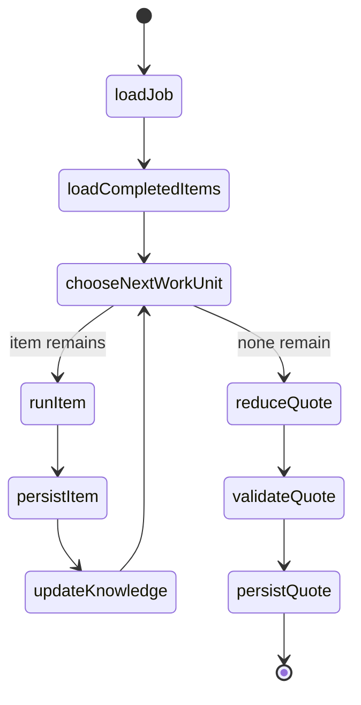
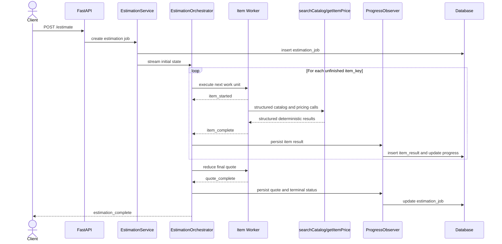
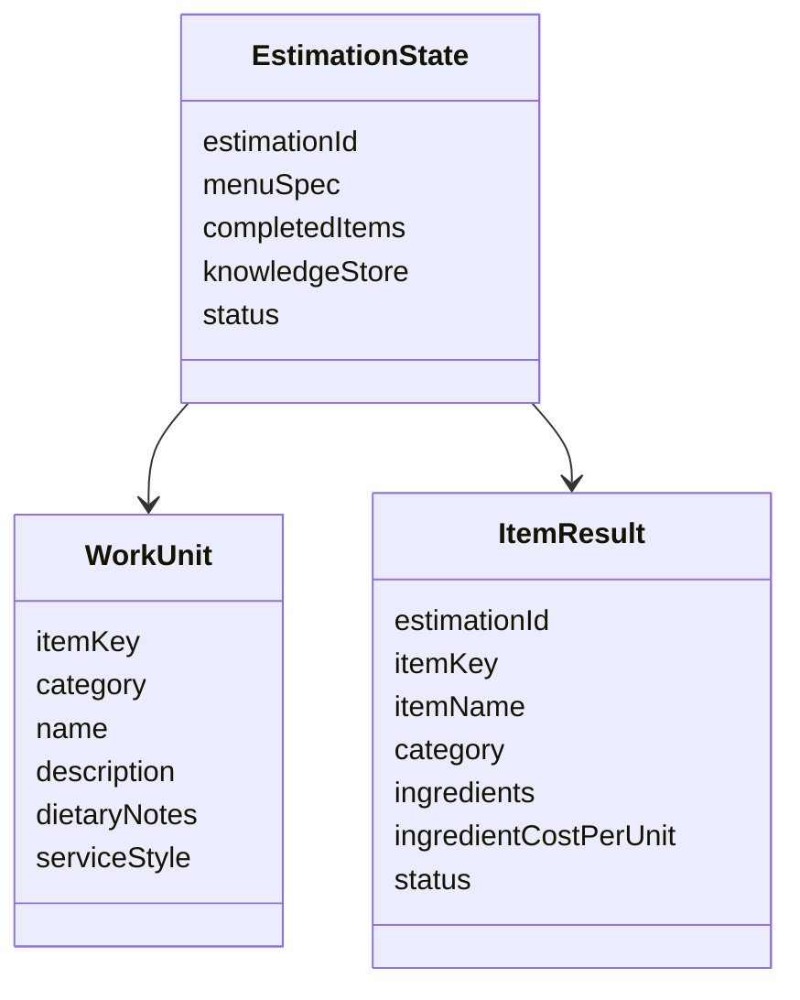
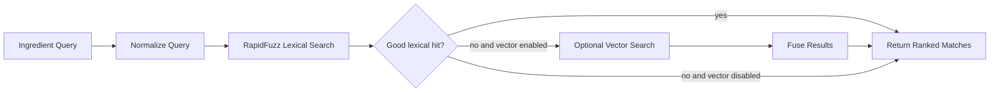
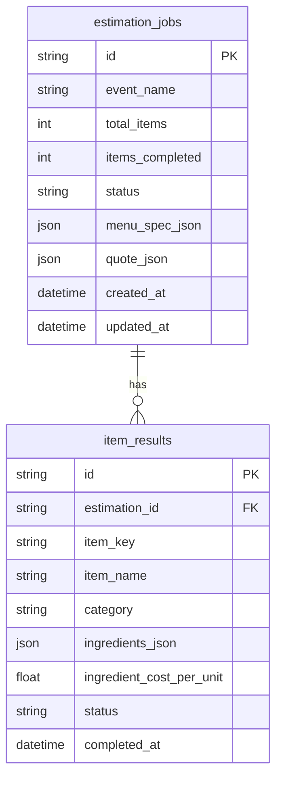
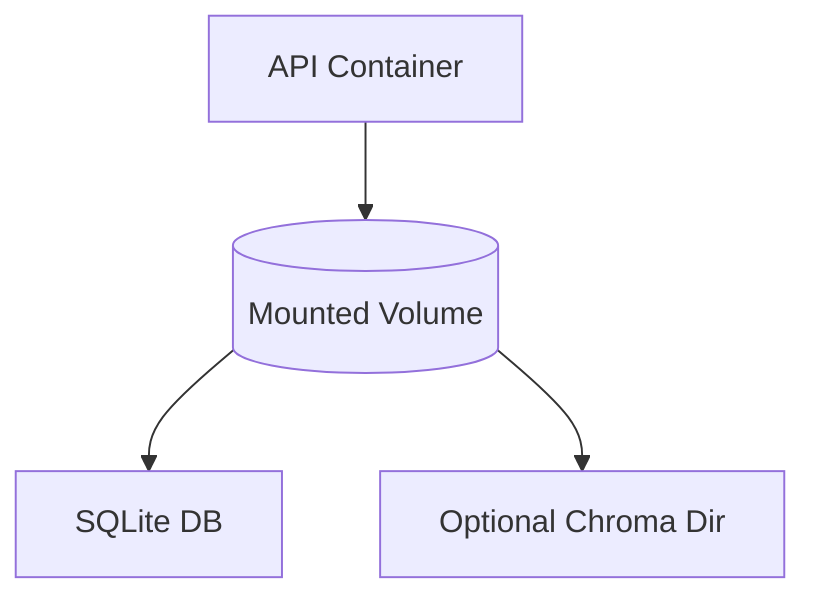
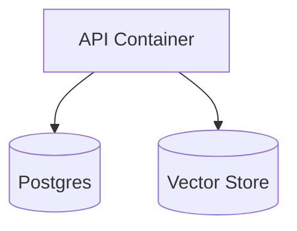

# Yes Chef Architecture

> Challenge-first system design for the Yes Chef catering estimation prototype.
>
> Last updated: 2026-03-06

---

## 1. System Goal

Yes Chef exists to solve one narrow business problem well:

1. Take a menu specification.
2. Infer ingredients and quantities for each menu item.
3. Match those ingredients against the Sysco catalog.
4. Convert case pricing into per-serving costs.
5. Produce a quote that conforms to `data/quote_schema.json`.

The assessment is explicitly about reliability under interruption, not about building the most elaborate agent platform. The architecture therefore optimizes for:

- small, repeatable units of model work
- checkpointed progress after each completed item
- deterministic math and output assembly
- a deployment story that matches what actually runs

---

## 2. Design Principles

The system follows a challenge-first interpretation of the rules in `challenge_instructions.md` and the engineering patterns in `AI_ENGINEERING_PRINCIPLES.md`.

| Principle | What it means in Yes Chef |
| --- | --- |
| LLM as infrastructure | The model handles culinary reasoning only. Python handles retrieval formatting, arithmetic, persistence, and final schema validation. |
| Workflow over autonomy | This is a durable workflow with a model inside it, not an open-ended autonomous agent. |
| One item is the durable unit | Resume, progress, and persistence are all keyed to a single menu item via `item_key`. |
| Fresh context per item | Each item gets a new prompt plus bounded carry-forward findings. No growing chat transcript. |
| Deterministic outputs matter | Tools and reducers should return structured data, not prose that the LLM must re-parse. |
| Separate transient from durable events | Heartbeats inform the client. Only completed items, final quote, and terminal failures change durable state. |
| Honest deployability | The primary documented runtime is the single-container SQLite-backed path that the repository actually uses. |

---

## 3. Current Runtime Shape

The implementation already contains the right primitives for the challenge:

- `app/application/work_units.py` creates stable `item_key`s.
- `app/application/estimation_service.py` reconstructs completed work and knowledge on resume.
- `app/agent/nodes/batch_worker.py` processes one item at a time even though the naming still says `batch`.
- `app/agent/nodes/reduce.py` assembles the quote from completed items.
- `app/application/progress_observer.py` persists completed items and the final quote.

The main problem was architectural drift: the previous document described a heavier batched and hybrid-search-first system than the code actually runs. This document resets the source of truth around the real and intended runtime.

---

## 4. High-Level Architecture

```mermaid
flowchart TD
    client[Client] --> api[FastAPI Routes]
    api --> service[EstimationService]
    service --> orchestrator[EstimationOrchestrator]
    orchestrator --> graph[LangGraph Workflow]
    graph --> worker[Single Item Worker]
    graph --> reducer[Quote Reducer]
    worker --> llm[LLM Client]
    worker --> tools[Catalog Tools]
    tools --> catalog[CatalogIndex]
    service --> observer[ProgressObserver]
    observer --> repo[Repositories]
    repo --> db[(SQLite or Postgres)]
    reducer --> schema[Quote Schema Validation]
```

### Why this shape

- `FastAPI` provides the API and SSE stream.
- `EstimationService` creates and resumes jobs.
- `EstimationOrchestrator` turns graph output and runtime progress into one client-facing stream.
- LangGraph remains a thin workflow shell: route next item, process item, reduce final quote.
- The worker keeps the LLM loop local to one item.
- The observer owns persistence side effects.

---

## 5. Durable Unit Of Work

The durable unit is **one menu item**, not a batch.



### Why item-level durability

- It matches the assessment's resumability requirement exactly.
- It minimizes lost work if the process is interrupted.
- It simplifies duplicate-name handling by binding persistence to `item_key`.
- It keeps prompts and retries small and explainable.

`item_key` is derived from menu order, for example `appetizers:0`, and is the canonical identity for progress and resume.

---

## 6. Request Lifecycle



---

## 7. State And Resume Model



### Resume behavior

On resume:

1. Load the job from durable storage.
2. Load all completed `item_results`.
3. Re-align them against the current menu spec by `item_key`.
4. Reconstruct the bounded knowledge store from those results.
5. Continue only with unfinished work units.

This makes interruption recovery a property of normal execution, not a bolt-on recovery mode.

---

## 8. Worker Design

The worker prompt is intentionally narrow:

- exactly one menu item
- current category and description
- bounded knowledge hints from earlier completed items
- tools for catalog lookup and deterministic price calculation
- validation and retry if the output is inconsistent

### Responsibilities by layer

| Concern | Owner |
| --- | --- |
| Infer ingredients | LLM |
| Estimate per-serving quantities | LLM |
| Search catalog candidates | Python tool |
| Parse UoM and compute cost | Python tool |
| Persist progress | Observer |
| Assemble quote | Reducer |
| Validate final schema | JSON Schema validator |

This division keeps the model focused on the only part that actually needs model reasoning.

---

## 9. Retrieval Strategy

The challenge catalog is small: roughly 565 items. For that scale, lexical-first retrieval is the correct default.



### Decision

- Primary challenge path: lexical search only.
- Optional extension path: lexical plus vector search behind a flag.

This keeps the default runtime cheap, simple, and deployable while still preserving a path to future scale.

---

## 10. Tool Contracts

Tool contracts should be structured and model-friendly.

### `search_catalog`

Should return structured candidates, not formatted text paragraphs. The model should receive:

- item number
- description
- unit of measure
- cost per case
- confidence score

### `get_item_price`

Should return a structured calculation object, not a rendered explanation string. The model should receive:

- requested quantity
- calculated unit cost
- case information used in the calculation

This reduces model parsing burden and makes debugging easier.

---

## 11. Event Model

The external event stream must distinguish between runtime feedback and durable state transitions.

```mermaid
flowchart LR
    runtime[Runtime Progress] --> gateway[Event Gateway]
    graph[Graph Updates] --> gateway
    gateway --> transient[Transient SSE Events]
    gateway --> durable[Durable Milestones]
    durable --> observer[ProgressObserver]
    transient --> client[Client]
    durable --> client
```

### Transient events

- `item_started`
- `llm_waiting`
- `tool_started`
- `tool_waiting`
- `tool_finished`
- `validation_retry`

### Durable events

- `item_complete`
- `quote_complete`
- terminal `error`
- final `estimation_complete` with the actual reduced status

The system should never imply persistence from a heartbeat event.

---

## 12. Persistence Model



### Persistence policy

For the assessment path, SQLite is the default durable store. Postgres remains a supported future path, but it is not the primary documented runtime anymore.

The important property is not the database brand. It is that completed items survive interruption and can be resumed safely.

---

## 13. Deployment Modes

### Challenge path



This is the primary deployment story because it matches the repository's actual runtime:

- one API container
- one persistent disk mount
- SQLite by default
- vector storage optional

### Growth path



This is a future extension path, not the assessment default.

---

## 14. Architecture Decision Records

### ADR-001: Choose A Durable Single-Item Workflow

- Status: accepted
- Context: the assessment tests interruption and resume, and the current code already processes one item at a time.
- Decision: define one menu item as the only durable unit of work.
- Consequence: naming, events, tests, and docs must stop pretending the runtime is truly batched.

### ADR-002: Lexical-First Retrieval For The Challenge Path

- Status: accepted
- Context: the catalog is small and structurally regular.
- Decision: default to lexical search and keep vector search optional behind configuration.
- Consequence: simpler deployment, lower cost, less architecture drift.

### ADR-003: Deterministic Quote Finalization

- Status: accepted
- Context: the final quote is the public contract of the system.
- Decision: assemble the quote in one reducer path and validate it against `data/quote_schema.json`.
- Consequence: worker-side final quote shortcuts should be removed.

### ADR-004: Separate Transient And Durable Events

- Status: accepted
- Context: users need progress feedback, but only some events correspond to persisted state.
- Decision: heartbeats remain transient; completed items and the final quote remain durable milestones.
- Consequence: the orchestrator is the single event gateway.

### ADR-005: Prefer Honest Deployability Over Production Theater

- Status: accepted
- Context: the repository currently deploys as a single-container service, while prior documentation described a heavier default topology.
- Decision: document the single-container SQLite-backed runtime as the main path and move heavier infrastructure to a future-state section.
- Consequence: the repo becomes easier to evaluate, deploy, and reason about.

---

## 15. What Changes At Larger Scale

If Yes Chef grows beyond the assessment, the architecture can evolve without rewriting the core workflow:

- swap SQLite for Postgres
- enable vector search only when retrieval quality demands it
- add ingredient-level caching across estimations
- add explicit evaluation runs against known menus
- move durable orchestration to an external workflow engine if concurrent long-running jobs become a real constraint

Those are deliberate phase-two changes, not requirements for the assessment submission.

---

## 16. Summary

Yes Chef is best understood as a **durable estimation workflow**:

- one item at a time
- one checkpoint per completed item
- one reducer for final quote assembly
- one event gateway for client feedback
- one honest deployment story

That is the smallest architecture that satisfies the brief while leaving clean extension seams for future scale.
