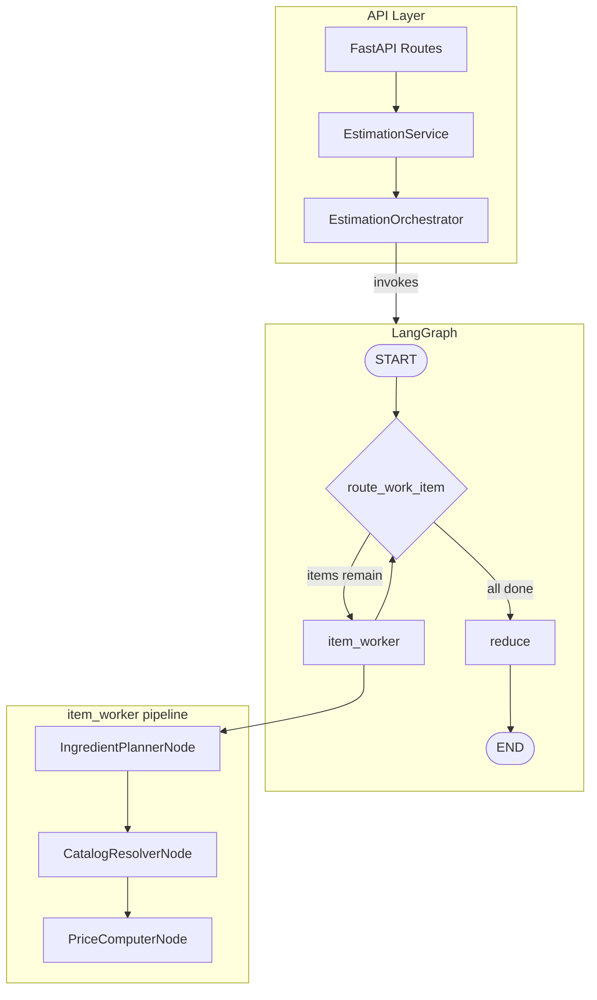

# Yes Chef

AI agent backend that estimates catering ingredient costs from menu specs using real tool calls against a Sysco catalog.

**Live API:** [https://yes-chef-production.up.railway.app](https://yes-chef-production.up.railway.app)

---

## Quick start

**Run locally:**

```bash
uv run uvicorn app.main:app --host 0.0.0.0 --port 8000
```

**Test against the deployed API:**

```bash
uv run python test_stream.py --file data/menu_spec.json --base-url https://yes-chef-production.up.railway.app
```

---

## Testing

`test_stream.py` is the primary way to exercise the API: health check, live TUI, final summary (tokens, schema validity).


| Target   | Command                                                                                                         |
| -------- | --------------------------------------------------------------------------------------------------------------- |
| Deployed | `uv run python test_stream.py --file data/menu_spec.json --base-url https://yes-chef-production.up.railway.app` |
| Local    | `uv run python test_stream.py --file data/menu_spec.json`                                                       |


**Stress testing** ([artifacts/stress-test/](artifacts/stress-test/)):


| Items | Command                                                                                                                               |
| ----- | ------------------------------------------------------------------------------------------------------------------------------------- |
| 100   | `uv run python test_stream.py --file artifacts/stress-test/menu_100_items.json --base-url https://yes-chef-production.up.railway.app` |
| 250   | `uv run python test_stream.py --file artifacts/stress-test/menu_250_items.json --base-url https://yes-chef-production.up.railway.app` |
| 500   | `uv run python test_stream.py --file artifacts/stress-test/menu_500_items.json --base-url https://yes-chef-production.up.railway.app` |


For local runs, omit `--base-url`. Regenerate menus: `uv run python scripts/generate_stress_menus.py`.

**Benchmarking:** Use `test_stream.py` and compare before/after changes: elapsed time, total tokens (`estimation_metrics`), retries and tool call counts, schema validity, quote completion.

---

## API usage

**Base URL:** `https://yes-chef-production.up.railway.app` (or `http://localhost:8000` for local)


| Method         | URL / Command                                                                                                                     |
| -------------- | --------------------------------------------------------------------------------------------------------------------------------- |
| Swagger UI     | [https://yes-chef-production.up.railway.app/docs](https://yes-chef-production.up.railway.app/docs)                                |
| test_stream.py | `uv run python test_stream.py --file data/menu_spec.json --base-url https://yes-chef-production.up.railway.app`                   |
| curl (start)   | `curl -N -X POST https://yes-chef-production.up.railway.app/estimate -H "Content-Type: application/json" -d @data/menu_spec.json` |
| curl (resume)  | `curl -N -X POST https://yes-chef-production.up.railway.app/estimate/{id}/resume`                                                 |


**Request format:** Menu spec JSON with `event`, `date`, `venue`, `guest_count_estimate`, `notes`, `categories` (see [data/menu_spec.json](data/menu_spec.json)).

### Stats stream (interrupt and resume)

Stats-only SSE endpoints for progress without parsing raw events:


| Endpoint                            | Purpose                                |
| ----------------------------------- | -------------------------------------- |
| `POST /estimate/stream`             | Start estimation, receive stats events |
| `POST /estimate/{id}/resume/stream` | Resume interrupted estimation          |


**Interrupt:** Close connection (Ctrl+C). Capture `estimation_id` from the first event before interrupting.

**Resume:** `POST /estimate/{id}/resume/stream` with the captured ID.

```bash
# Start stats stream
curl -N -X POST https://yes-chef-production.up.railway.app/estimate/stream \
  -H "Content-Type: application/json" -d @data/menu_spec.json

# Resume (replace {id} with estimation_id from stream)
curl -N -X POST https://yes-chef-production.up.railway.app/estimate/{id}/resume/stream
```

**Polling:** `GET /estimate/{id}` to poll status and retrieve the final quote.

---

## Deployment

### PaaS (Railway, Render, Fly.io, etc.)

1. Build from Dockerfile (expose port 8000)
2. Set `OPENAI_API_KEY` (required), `DATABASE_URL` (optional; default SQLite)
3. For SQLite: persistent volume at `/app/data`
4. For Postgres: `DATABASE_URL=postgresql://...`

### VM (EC2, DigitalOcean, GCP)

```bash
./scripts/deploy-vm.sh              # Prompts for OPENAI_API_KEY if .env missing
./scripts/deploy-vm.sh --skip-env    # Use existing .env
./scripts/deploy-vm.sh --systemd    # Start on boot
```

Requires Docker. Script creates `.env`, builds image, runs container with data volume.

---

## Configuration


| Variable                  | Default     | Purpose                        |
| ------------------------- | ----------- | ------------------------------ |
| `OPENAI_API_KEY`          | —           | Required                       |
| `DATABASE_URL`            | SQLite path | Optional                       |
| `OPENAI_MODEL`            | gpt-4o-mini | Primary model                  |
| `BATCH_SIZE`              | 5           | Items per batch                |
| `PLANNING_POOL_SIZE`      | 6           | Parallel planning              |
| `TOOL_RESULT_MAX_MATCHES` | 3           | Catalog matches per ingredient |


---

## Architecture

The system uses a **durable single-item workflow**: one menu item is the unit of work. Each item gets a fresh LLM prompt and bounded knowledge carry-forward. Interrupting loses at most the current batch; resume reconstructs state from persisted completed items.




**Request flow:** FastAPI receives the menu spec, EstimationService creates an estimation and invokes the Orchestrator. The Orchestrator runs the compiled LangGraph and streams SSE events (item_complete, quote_complete, estimation_metrics) back to the client.

**Graph flow:** `route_work_item` checks for unprocessed items. If any remain, control goes to `item_worker`; otherwise to `reduce`. The item_worker processes a batch of items: **plan** (LLM extracts ingredients per item, parallel via PlanningPool), **resolve** (CatalogResolverNode matches ingredients to Sysco catalog with global cache), **price** (PriceComputerNode computes unit costs). Completed items are persisted by the ProgressObserver. When all items are done, `reduce` aggregates them into the final quote.

**Persistence:** Per-item checkpointing on `item_complete`. KnowledgeStore records catalog hits and misses; on resume it is rebuilt from persisted results so the agent does not re-discover the same failures. No growing chat transcript—each item gets a new prompt.

---

## Future improvements

**Infrastructure**

- Evaluate the possibility of external workflow engine (like Temporal) if concurrent long-running jobs become a constraint
- Structured logging and tracing with Langfuse for observability

**Retrieval and caching**

- Implement hybrid search: incorporate vector-based catalog lookups to enhance fuzzy and semantic matching accuracy
- Ingredient-level caching across estimations (same ingredient + quantity → reuse cost)
- Catalog pre-indexing or embedding for faster resolution

**Quality and evaluation**

- Explicit evaluation runs against known menus with golden outputs
- A/B testing for prompt or model changes
- Validation rules and repair strategies for edge cases (units, allergens, dietary)

**Cost and performance**

- Token budget enforcement
- Model routing (cheaper model for simple items, stronger for complex)

