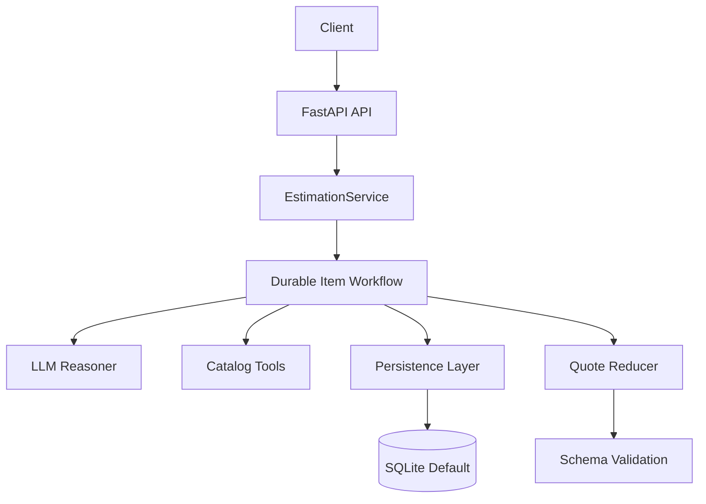
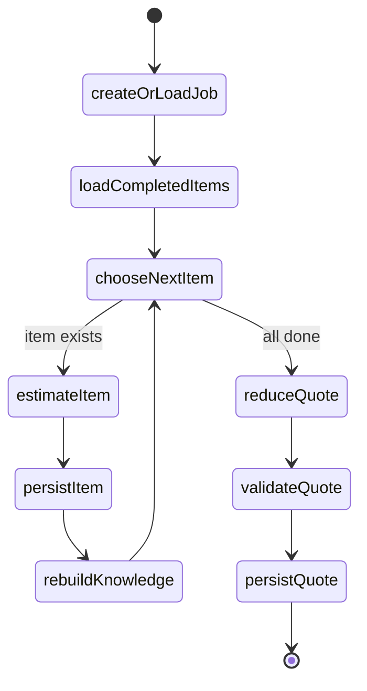

# Yes Chef Challenge-First Design

## Goal

Reframe Yes Chef around the smallest architecture that cleanly satisfies the assessment:

- accurate per-item ingredient costing
- persisted progress after each completed item
- resumability after interruption
- clear deployability
- an architecture story that matches the code

## Chosen Direction

We are treating Yes Chef as a **durable workflow** instead of a highly autonomous agent platform.

The durable unit of work is one menu item identified by `item_key`. The LLM is responsible for culinary reasoning only. Python owns deterministic concerns like retrieval packaging, unit conversion, price math, persistence, quote reduction, and final output validation.

## Why The Reset Was Necessary

Before the reset, the repo had drifted into an awkward middle state:

- the docs described a heavier pseudo-batched architecture
- the runtime was already processing one item at a time
- the deployment story in the docs no longer matched the real container setup
- tool contracts still forced the model to parse deterministic string output

That mismatch made the system harder to reason about than the actual challenge demanded.

## Design Principles

1. Keep the workflow explicit.
2. Keep durable state at the item boundary.
3. Keep the model focused on reasoning, not arithmetic.
4. Keep retrieval and final output deterministic where possible.
5. Keep deployment honest.

## Target System View

## Durable Execution Loop

## Event Model

The external stream should contain both runtime visibility and durable milestones, but those concerns must stay distinct.

### Transient runtime signals

- item started
- waiting on LLM
- tool started
- tool waiting
- tool finished
- validation retry

### Durable milestones

- item complete
- quote complete
- terminal error
- estimation complete with final status

## Retrieval Strategy

For the challenge catalog size, lexical-first retrieval is the default. Vector retrieval remains optional and feature-flagged for later growth.

## Deployment Story

The challenge path is a single API container with a mounted persistent volume. SQLite is the default durable store. That is the primary story because it matches the current runtime and is easy for evaluators to deploy.

A Postgres-backed version remains a future extension, not the default explanation.

## Expected Outcomes

When the rebuild is complete:

- the docs and code will describe the same system
- resumability will clearly center on `item_key`
- event semantics will be easier to explain
- the quote contract will be more trustworthy
- the repository will read like a coherent prototype instead of a partially reversed platform abstraction
